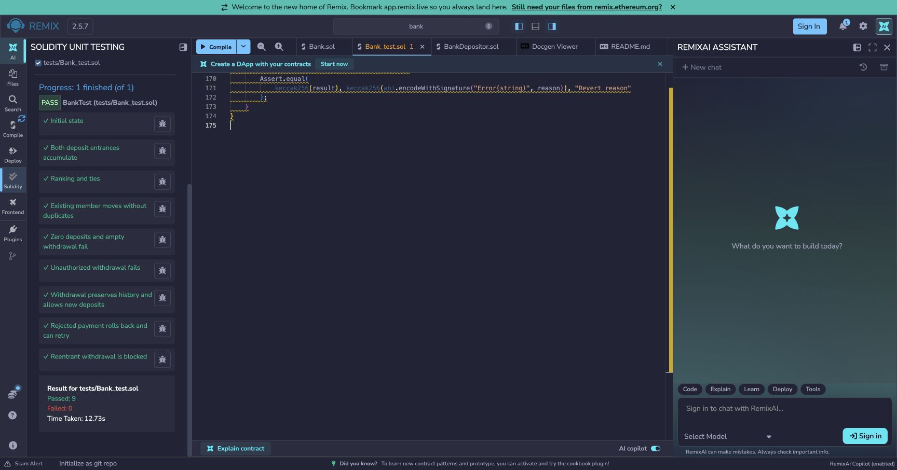
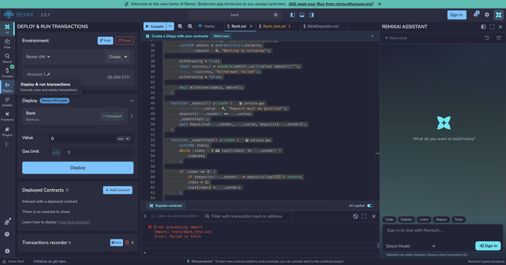
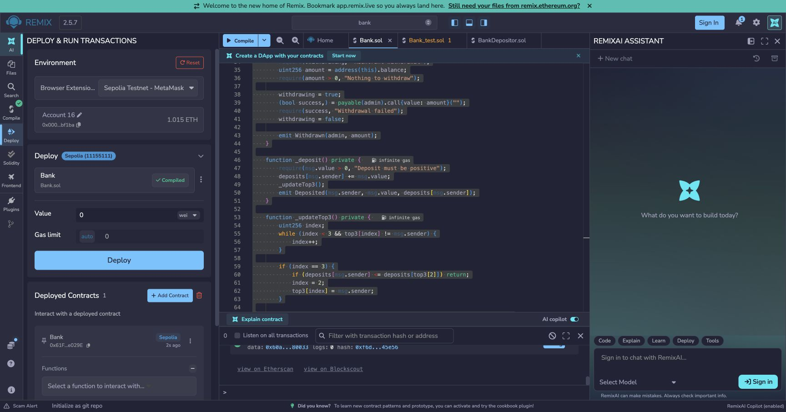

# 05 · ETH 银行：存款、排行榜与管理员提款

这个银行练习接收 ETH，记住每个地址历史上存过多少，并显示前三名。它只有管理员统一提款，**没有普通用户按余额取钱的接口**。先理解这一点，才能正确解释账本。

先完成 [04 Counter](../firstcontract-04/README.md) 的读写练习，再学习这里的金额和权限。

## 先算一遍，再操作

Alice 存 1 ETH，Bob 存 2 ETH，Alice 再存 2 ETH。历史累计是 Alice 3、Bob 2；银行实际持有 5 ETH，排行榜是 Alice、Bob。

管理员提走全部 5 ETH 后：银行实际余额变成 0，Alice 的历史仍为 3、Bob 仍为 2，排行榜不变。`deposits` 是历史贡献记录，不能当作个人可提现余额。

金额最小单位叫 Wei，`1 ETH = 10^18 Wei`。Remix 的 Value 是这次交易附带的 ETH，换单位前确认输入值；读合约返回的整数默认按 Wei 理解。

## 从零完成一次本地演练

在 Remix 导入本项目 `contracts/` 与 `tests/`，编译器选 `0.8.24`，EVM 目标选 `shanghai`。选 **Remix VM**，本节只使用模拟 ETH。

1. 账户 A、Value `0 Wei`，部署 `contracts/Bank.sol` 的 `Bank`；记下 A 的地址和银行地址。`admin()` 应返回 A。
2. 切账户 B，Value 设为 `1 Ether`，调用 `deposit()`；`deposits(B)` 应为 `1000000000000000000`。
3. 切账户 C，存入 `2 Ether`；再切 B，存入 `2 Ether`。
4. 调用 `getTop3()`：B 为 3 ETH、C 为 2 ETH，剩余名次是零地址。直接读取合约余额应为 5 ETH。
5. 把 Value 改回 `0 Wei`。用 B 调 `withdraw()` 应失败；切回 A 调用，应成功。
6. 重新查询实际余额、`deposits(B)` 与排行榜，对照上一节的数字。

合约还支持空 calldata 的直接 ETH 转账，进入 `receive()`。它和 `deposit()` 共用同一记账流程。不要混淆第 07 项目中“直接转 ERC20 不记账”的规则：ETH 和 ERC20 的接收机制不同。

## 存款和提款怎样执行

```text
钱包附带 ETH → deposit 或 receive → _deposit
先检查金额 > 0 → 累加 deposits → 调整 top3 → 发出 Deposited

管理员 → withdraw → 检查权限、余额和提款锁
将实际 ETH 转给管理员 → 成功后发出 Withdrawn
```

只有当前存款人的累计额增加，所以排行榜只需把这个人向前移动，最多处理三个位置。榜外人必须严格超过第三名；同额不会挤掉已有名次，地址也不会重复上榜。

提款中的外部转账可能触发接收合约代码，提款锁阻止回调重复提款。如果收款失败，整个提款回滚，资金留在银行；公共链上的失败交易仍可能消耗 Gas。

## 测试和代码入口

在 Remix 插件中启用 **Solidity Unit Testing**，选 `tests/Bank_test.sol` 运行。`remix_tests.sol` 由插件提供，不能直接把这些测试当 Forge 用例。

- [Bank.sol](contracts/Bank.sol)：按 `_deposit → _updateTop3 → withdraw` 阅读。
- [Bank_test.sol](tests/Bank_test.sol)：看累计、同额排名、提款权限和失败状态。
- [BankDepositor.sol](tests/BankDepositor.sol)：理解测试如何用辅助合约模拟不同存款人。

排错先检查三件事：调用账户是否正确、Value 是否忘记归零、查看的是实际资产还是历史金额。2026-10-09 已本地编译 `contracts/`；未重跑 Remix 交互或公共链操作。

## 历史操作与证据

该次按以下顺序完成：先确定累计存款、固定管理员和同额排名规则；再实现三个 Solidity 文件；随后在 Remix 编译并运行九项测试；最后连接 MetaMask 部署到 Sepolia，并用 RPC 回执、运行代码和 `admin()` 查询交叉核对。

以下为 **2026-09-08 原版代码**在 Chrome 的 Remix `bank` 工作区的运行记录：

- Bank 编译成功：Solidity `0.8.24+commit.e11b9ed9`、EVM `shanghai`、Optimization 关闭。
- Solidity Unit Testing：**9 项通过，0 项失败，最终复核耗时 12.73 秒**。
- 当时通过编辑器复制读取，核对三个 Solidity 文件与当时本地文件的非空白内容一致。
- Sepolia 部署成功：RPC 交易回执 `status=0x1`，区块 `11658519`；链上运行代码为 `4309` 字节，`admin()` 返回下面的钱包地址。
- 部署消耗 Gas `981608`，实际 Gas 费用 `0.002534424113005704 Sepolia ETH`，部署 Value 为 `0 Wei`。
- 直接存款与管理员提款尚未执行，等待对具体金额和剩余 Gas 上限的授权。

该次后续修订补充了中文注释和阅读说明；下列截图与部署记录仍对应原版，不代表重新编译、重新运行测试或重新部署了注释版。

注释不改变业务逻辑，但源码变动会影响编译元数据及默认附加在字节码中的元数据哈希。原版代码可从 Git 提交 `e7ca1b8` 查看；若做严格的部署源码校验，还需保留部署时 Remix 中的原始源码和编译设置，不能把“忽略空白后一致”等同于字节码完全一致。[Solidity：合约元数据](https://docs.soliditylang.org/en/v0.8.24/metadata.html)

```text
Remix 编译：通过
Remix 自动化测试：9 passed / 0 failed
网络：Sepolia
管理员地址：0x000071424bb08b910f0786e04d964a63d64bf1ba
Bank 合约地址：0x61Ff21654B8221Aa61D0378859c27049281e029E
部署交易 Hash：0xa5be452b7a40c135a16b9a6ec1866a358e64a9e6bba17e8607c51e148ae72091
直接存款交易 Hash：待操作
管理员提款交易 Hash：待操作
```

- [Bank 合约](https://sepolia.etherscan.io/address/0x61Ff21654B8221Aa61D0378859c27049281e029E)
- [部署交易](https://sepolia.etherscan.io/tx/0xa5be452b7a40c135a16b9a6ec1866a358e64a9e6bba17e8607c51e148ae72091)

### 测试结果



### 编译结果



编译截图的控制台保留了早期导入失败的日志；最终测试结果以上方九项全部通过的截图为准。

### Sepolia 部署结果


