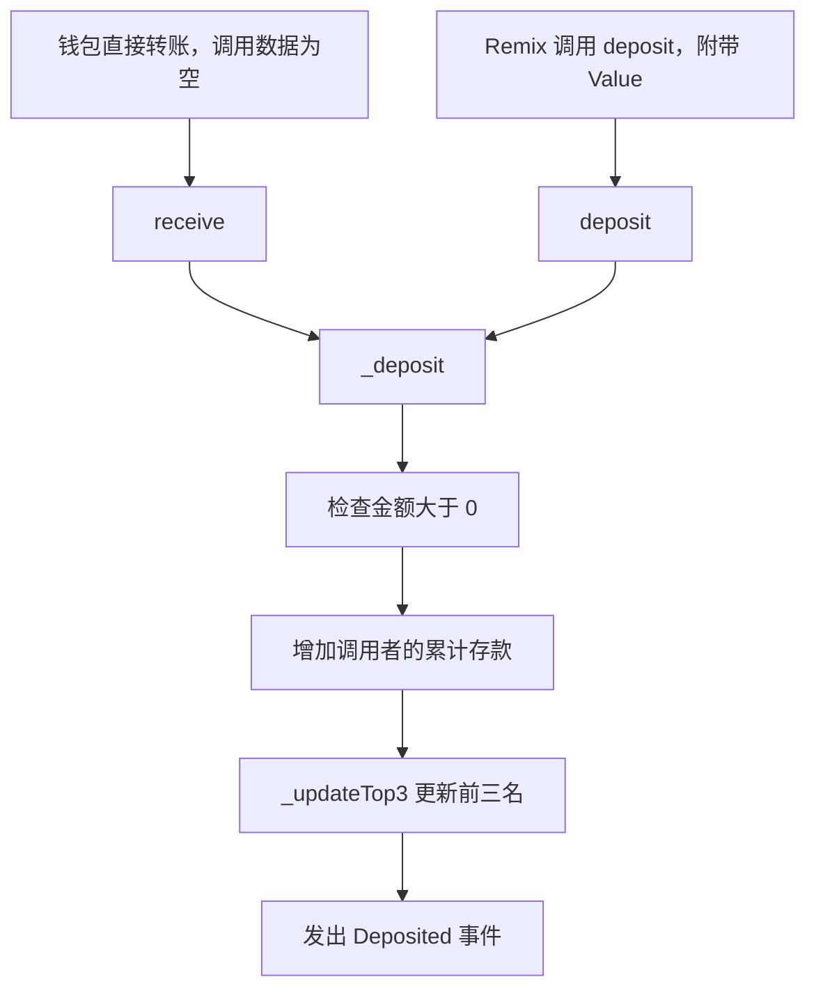
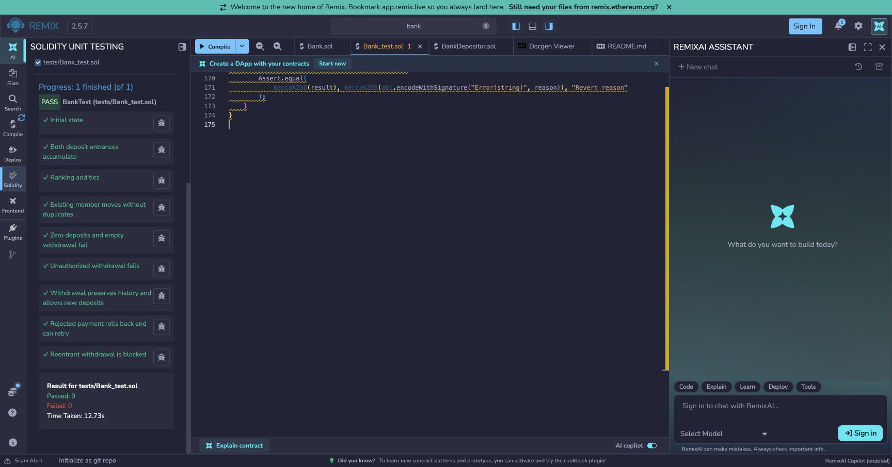
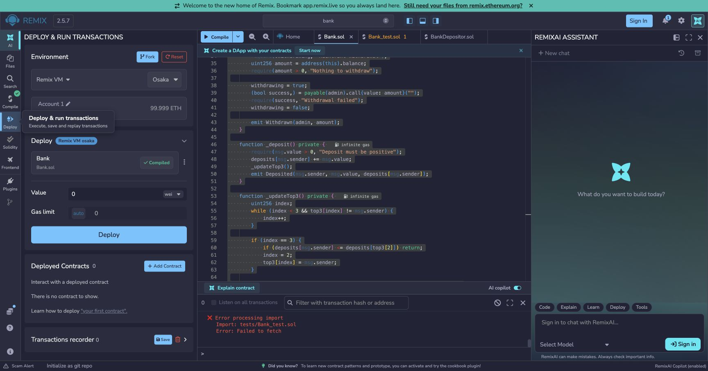
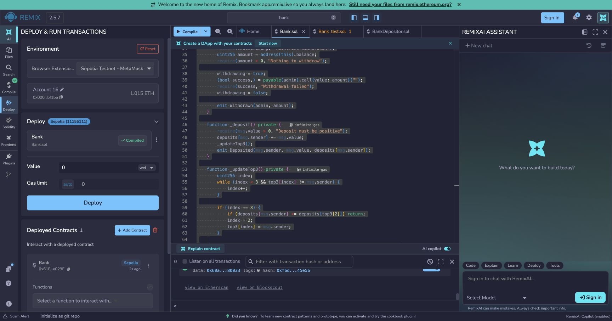

# Bank：Remix 合约练习

这个练习实现一个接收 ETH、记录每人累计存款、维护前三名，并允许管理员统一提款的 Bank 合约。开发、编译、测试和部署都在 Remix 完成，本地目录负责保存源码、说明和截图。

建议按本文顺序阅读：先理解规则和代码，再在 Remix VM 验证，最后用 MetaMask 在 Sepolia 操作，并保存证据、提交到 GitHub。

**当前进度：合约实现、九项自动化测试、Sepolia 部署及原版代码和截图推送已完成；Sepolia 钱包直接存款和管理员提款尚未执行。** 下文的实操步骤与预期结果用于复现，不能代替实际交易记录。

## 一、需求与项目结构

题目的四项要求对应如下实现：

1. MetaMask 向合约转入 ETH：由 `receive()` 接收，另提供可在 Remix 点击的 `deposit()`。
2. 记录每个地址的存款金额：用 `deposits` 映射保存历史累计值。
3. 用数组保存存款前三名：用固定长度数组 `top3` 保存地址。
4. 只有管理员能提取全部 ETH：部署时记录 `admin`，在 `withdraw()` 检查权限。

项目只需要以下文件，不需要安装 Foundry、Hardhat 或前端工程：

```text
bank/
├── contracts/
│   └── Bank.sol
├── tests/
│   ├── BankDepositor.sol
│   └── Bank_test.sol
├── screenshots/
│   ├── 02-remix-compiled.jpg
│   ├── 03-sepolia-deployed.jpg
│   └── 04-remix-tests-final.jpg
└── README.md
```

- [Bank.sol](contracts/Bank.sol)：先读这个文件，理解实际部署的合约；无第三方合约依赖。
- [BankDepositor.sol](tests/BankDepositor.sol)：再读辅助合约，理解如何模拟不同存款人。
- [Bank_test.sol](tests/Bank_test.sol)：最后读九项测试，查看正常操作和失败场景。
- `screenshots/`：随项目提交的编译、测试和部署截图。
- `README.md`：规则、操作步骤和实际验证记录。

## 二、规则与代码如何对应

### 先确定金额和权限的含义

- 部署者是固定管理员，`admin()` 返回其地址。
- `deposits(address)` 表示历史累计存入金额，单位 Wei；不是用户可自行提取的余额。
- `receive()` 接收钱包直接转账，`deposit()` 支持在 Remix 点击存款，两者共用记账逻辑；零金额会回退。
- `top3(0)` 到 `top3(2)` 按累计金额降序排列；`getTop3()` 一次返回三个地址和对应金额。空位为零地址、零金额。
- 同额保持已有顺序；榜外地址与第三名同额时不替换，只有严格超过才改变相对排名。
- `withdraw()` 仅管理员可调用，全部 ETH 转回管理员；空余额提款、重入和收款失败均回退。
- 提款不清空累计存款和排行榜，之后的新存款继续累计。
- 存款和提款分别发出 `Deposited`、`Withdrawn` 事件。

只有当前存款人的累计金额增加，因此排行榜只检查三个位置，无需遍历全部存款人。榜内地址向前移动，榜外地址先与第三名比较；同额比较使用严格大于，避免重复地址和同额挤榜。

合约实际余额直接读取链上余额，不能用累计存款之和代替：提款会降低实际余额；不触发存款入口的强制 ETH 转入也不会计入个人历史。管理员提取的是实际余额。

例如 A 存入 2 ETH、B 存入 1 ETH，管理员随后提取 3 ETH。此时合约余额为 0，但 `deposits(A)` 仍为 2 ETH，`deposits(B)` 仍为 1 ETH，排名仍是 A、B。这里没有普通用户自行提款、利息或管理员更换功能。

### 读代码时先认识这些值

- `msg.sender`：当前这次调用的直接调用者。钱包直接调用时是钱包地址；辅助合约调用时是辅助合约地址。
- `msg.value`：本次调用附带的 ETH 数量，以 Wei 表示。`1 ETH = 10^18 Wei`。
- `address(this).balance`：Bank 此刻实际持有的 Wei 数量。
- `payable`：允许调用时附带 ETH；`view`：该函数不修改链上状态。
- `public` 状态变量：编译器生成查询接口，例如 `admin()`、`deposits(地址)`、`top3(下标)`。
- `require(条件, 原因)`：条件不成立时让调用回退。低级 `call` 可以捕获失败，调用者需决定是否继续回退。

公开变量并不意味着别人可以任意修改它；外部修改仍必须经过合约定义的函数。[Solidity：公开变量和查询接口](https://docs.soliditylang.org/en/v0.8.24/contracts.html#getter-functions)

### 一笔存款如何执行



`receive()` 和 `deposit()` 只负责接入，两者都调用 `_deposit()`。这是合约内部调用，`msg.sender` 和 `msg.value` 保持原值，所以两条入口记到账上的人和金额遵循同一套规则。

钱包直接转账不附带函数调用数据，会进入 `receive()`；显式调用 `deposit()` 则带有对应的函数选择器。本合约没有 `fallback()`，未知函数调用不会被当作存款接收。[Solidity：接收 ETH](https://docs.soliditylang.org/en/v0.8.24/contracts.html#receive-ether-function)

### 前三名为什么不需要对所有存款人排序

每次存款只有一个地址的累计金额增加，其他地址的金额不变。`_updateTop3()` 因此只需处理当前存款人，查找最多三个位置、向前移动最多两次，工作量不会随总存款人数增加。

1. 先在数组中找当前地址。如果已在榜内，直接使用原位置，避免重复地址。
2. 如果不在榜内，先比较第三名。小于或等于第三名时不变；严格超过时替换第三名。
3. 从当前位置向前比较。严格超过前一名才交换位置，同额时停下。

不足三名时，空位是零地址，查询其累计金额得到 0。首次存款必须大于 0，所以会先填入尾部，再向前移动到正确位置。

下面与 `rankingAndTies()` 测试一致，所有数字单位都是 Wei：

```text
操作             当前累计金额           前三名
A 存 1           A=1                    A(1), 空, 空
B 存 2           B=2                    B(2), A(1), 空
C 存 3           C=3                    C(3), B(2), A(1)
D 存 2           D=2                    C(3), B(2), D(2)
A 再存 1         A=2                    C(3), B(2), D(2)
A 再存 1         A=3                    C(3), A(3), B(2)
A 再存 2         A=5                    A(5), C(3), B(2)
```

“同额保持顺序”指不越过当前的同额前人，也不挤掉同额第三名；不是按地址大小或第一次存款时间重新排序。A 虽然最早存款，累计到 2 时仍不能替换 D。

### 管理员提款如何执行

`withdraw()` 依次执行以下操作：

1. 检查调用者是 `admin`。
2. 检查当前没有另一笔提款正在执行，并读取 Bank 的实际余额；余额为 0 时拒绝。
3. 将 `withdrawing` 设为 `true`，再通过 `call` 将读取到的全部余额转给管理员。
4. 检查转账是否成功。失败就回退本次提款，包括已经设置的锁；成功则解锁并发出 `Withdrawn` 事件。

若管理员是合约，收到 ETH 时可能运行收款函数，并在里面再次调用 Bank。锁必须在转账前设置，才能阻止回调重入 `withdraw()`。测试合约专门模拟了这种情况。

正常收款且回调不转回 ETH 时，提款后余额为 0。`deposits` 和 `top3` 始终保留，因此不需要遍历所有存款人清零。

## 三、从零建立 Remix 工作区并编译

1. 打开 [Remix](https://remix.ethereum.org/)，创建空工作区 `bank`。本次官方入口自动跳转至 `https://app.remix.live/`。
2. 建立 `contracts`、`tests` 两个文件夹，将本项目同名文件导入对应目录。不能上传时，可以新建同名文件并粘贴源码。先选中项目根目录再创建文件夹，避免将 `tests` 建在 `contracts` 内。
3. 在 Solidity Compiler 中选择 `0.8.24+commit.e11b9ed9`，EVM Version 选 `shanghai`，关闭 Optimization。
4. 打开 `contracts/Bank.sol` 并编译。当前界面也可从顶部 Compile 旁的下拉菜单选择 **Open compiler configuration**。部署时选择 **Bank**，不要选择测试合约。

如果从零练习，按目录树新建三个 Solidity 文件，并参考带中文注释的源码逐段编写；如果复现本项目，直接导入三个文件即可。图片和 README 不参与合约编译。

源码固定 Solidity `0.8.24`，与本仓库前一个练习一致。先确认编译面板显示成功，再进入部署或测试。以后加载已部署合约时，也使用匹配的合约接口和编译版本。

## 四、运行自动化测试并理解测试结构

1. 在 Plugin Manager 中启用 **Solidity Unit Testing**。
2. 测试目录选择 `tests`，勾选 `Bank_test.sol`，点击 Run。
3. 查看九项测试的通过/失败结果。`remix_tests.sol` 由测试插件注入，无需下载或安装依赖。

测试中的 `#value` 使用 Wei，测试插件自动提供模拟资金。四个辅助存款合约让 Bank 实际看到四个不同的调用地址，避免把测试函数的 `msg.sender` 误当成 Bank 的调用者。每项测试部署全新的 Bank，部署它的测试合约充当管理员。

调用关系如下：

```text
测试运行器 → BankTest → new Bank()
                     Bank 的 admin = BankTest 地址

BankTest → BankDepositor A → Bank.deposit() 或 Bank.receive()
                            Bank 的 msg.sender = A 地址

BankTest → Bank.withdraw() → BankTest.receive()
                            模拟正常收款、拒收、重入
```

`beforeAll()` 只创建一次 A、B、C、D。`beforeEach()` 在每项测试开始前创建全新 Bank，并重置回调开关，因此上一项测试的排名和 Bank 余额不会污染下一项。[Remix：测试生命周期](https://remix-ide.readthedocs.io/en/latest/unittesting.html#writing-tests)

例如 `/// #value: 6` 让测试函数收到 6 Wei，再分别通过 A 转给 Bank。这个注释是 Remix 识别的配置，修改中文说明时也要保留它。

九项测试的阅读顺序：

1. `initialState()`：管理员、空余额和空排行榜的初始状态。
2. `bothDepositEntrancesAccumulate()`：`deposit()` 与直接转账累计记账。
3. `rankingAndTies()`：不足三名、榜外入榜、同额不替换、跨越多个排名。
4. `existingMemberMovesWithoutDuplicates()`：榜内追加存款、同额不换位、地址不重复。
5. `zeroDepositsAndEmptyWithdrawalFail()`：两个入口的零金额拒绝、空余额提款拒绝。
6. `unauthorizedWithdrawalFails()`：非管理员提款拒绝且保留资金。
7. `withdrawalPreservesHistoryAndAllowsNewDeposits()`：管理员收到全部余额，历史保留，再次存款和提款。
8. `rejectedPaymentRollsBackAndCanRetry()`：收款失败回滚、资金和排行榜保留，之后可重试。
9. `reentrantWithdrawalIsBlocked()`：管理员收款回调尝试重入，被提款锁阻止，外层提款成功。

末尾两个私有辅助函数负责核对排名和失败原因。`_expectRevert()` 用低级调用捕获错误，再检查原因字符串，避免“因为其他错误失败”也被当成测试通过。

## 五、在 Remix VM 手动走完存款与提款

这部分是可重复的手动操作脚本；自动化测试使用独立测试环境，不会自动在 Deploy & Run 面板生成这次手动演练的 Bank 实例。Remix VM 的 ETH 是浏览器模拟资金。[Remix：运行环境](https://remix-ide.readthedocs.io/en/latest/run.html#remix-vm)

1. Deploy & Run 中选择 **Remix VM**，Account 选账户 0，Value 设为 `0 Wei`，部署 Bank。
2. 调用 `admin()`，确认它等于账户 0。记录此模拟合约地址。
3. 切换账户 1，Value 设为 `1 Ether`，点击 `deposit()`。
4. 切换账户 2、3，分别存入 `2 Ether`、`3 Ether`；查询 `getTop3()`，应为账户 3、2、1。
5. 切换账户 4，存入 `2 Ether`；前三名应为账户 3、2、4，同额的账户 2 保持在前。
6. 账户 1 再存 `1 Ether`：累计为 2，与第三名同额，仍不上榜。再存 `2 Ether`：累计为 4，升至第一名。
7. Value 恢复为 `0 Wei`。用非管理员账户调用 `withdraw()`，应提示 `Only admin`。
8. 切回账户 0，调用 `withdraw()`，合约余额变为 0；历史金额和排行榜不变。
9. 再存入小额模拟 ETH，确认合约继续接收，累计金额继续增长。

这些 Ether 金额只用于 Remix VM 模拟；不要照搬到测试网。`withdraw()` 不是 payable，调用前必须把 Remix 的 Value 归零。

在第 6 步完成后、尚未提款时，预期状态如下：

```text
账户 1 累计存款：4 ETH
账户 2 累计存款：2 ETH
账户 3 累计存款：3 ETH
账户 4 累计存款：2 ETH
前三名：账户 1(4), 账户 3(3), 账户 2(2)
Bank 实际余额：11 ETH
```

第 8 步提款成功后，Bank 余额应为 0，上述四个累计金额和前三名不变。用 `deposits(地址)` 核对个人历史，用 `getTop3()` 核对顺序与金额，再查看合约余额，三种数据分别验证。

## 六、用 MetaMask 在 Sepolia 复现

先在 VM 得到预期结果，再切换测试网。下面第 1～4 步是连接与部署流程，第 5～9 步是钱包存款与提款流程；本项目实际执行到部署成功，后续交易仍待操作。

1. 将 MetaMask 切换到 **Sepolia**（chain ID `11155111`），确认选中的部署账户及测试币余额；已有测试币时直接复用。
2. Remix Deploy & Run 选择 **Browser Extension** 并连接 MetaMask（较旧版本名称为 Injected Provider - MetaMask）。核对网络、账户，Value 保持 `0 Wei`。
3. 选择 Bank，核对部署交易的预估 Gas 后由钱包确认部署。部署账户将永久成为管理员。
4. 记录合约地址和部署交易 Hash，调用 `admin()` 核对管理员。
5. 在 MetaMask 使用 Send，将少量 Sepolia ETH 发给该合约地址，不附加调用数据。建议演示金额为 `0.00001 Sepolia ETH`，具体交易和 Gas 以签名前确认内容为准。
6. 等待回执成功，回到 Remix 调用 `deposits(发送地址)` 和 `getTop3()`。`0.00001 ETH` 对应 `10000000000000 Wei`。
7. 如需验证另一个入口，在 Remix 填写同样的小额 Value，调用 `deposit()`，再核对累计金额。
8. Value 归零，切回管理员账户调用 `withdraw()`，核对回执、合约余额为 0、历史记录和排行榜保留。
9. 保存部署、直接存款和提款的交易 Hash，以及编译、测试、记账和提款后的截图。多地址排行榜的完整边界已由 VM 测试覆盖；测试网上如需多地址演示，再使用本人已有的测试账户。

如果继续操作本文记录的已部署实例，选择 Sepolia 后用 **Add Contract / At Address** 加载下面的 Bank 地址即可，无需再次部署。核对 `admin()` 与钱包账户；读取数据使用查询调用，存款和提款则需要钱包签名及交易确认。

对于初始余额和历史都为 0 的 Bank，首次仅由一个地址存入 `0.00001 ETH`、不执行可选的第二次存款时，核对顺序如下：

```text
存款前：deposits(发送地址)=0，Bank 余额=0
存款成功：deposits(发送地址)=10000000000000 Wei
          getTop3() 第一名为发送地址，金额为10000000000000 Wei
          Bank 余额=10000000000000 Wei
提款成功：Bank 余额=0
          deposits(发送地址) 和 getTop3() 与提款前相同
```

拿到交易 Hash 不代表交易成功，仍要检查回执状态。管理员如果用自己的钱包发起提款，钱包余额的净增加量是收到的 ETH 减去该笔 Gas，不能只用钱包余额差判断是否全额到账。

钱包直接存款会执行记账和排名逻辑，需要由钱包估算合约调用所需 Gas，不能固定成普通地址转账的 21,000。其他合约使用只有 2,300 Gas 津贴的 `send` / `transfer` 也无法完成此记账，应调用 `deposit()` 或使用能够提供足够 Gas 的调用方式。

连接钱包、部署、存款和提款分别核对对应操作；私钥、助记词和密码不得保存到本项目。展示截图保存在 `screenshots/` 并随项目提交；原始 RPC 读取结果等本地验证产物保存在仓库的 `output-tdd/`，不纳入代码提交。

## 七、本次实际完成的过程与证据

本次按以下顺序完成：先确定累计存款、固定管理员和同额排名规则；再实现三个 Solidity 文件；随后在 Remix 编译并运行九项测试；最后连接 MetaMask 部署到 Sepolia，并用 RPC 回执、运行代码和 `admin()` 查询交叉核对。

以下为 **2026-09-08 原版代码**在 Chrome 的 Remix `bank` 工作区的运行记录：

- Bank 编译成功：Solidity `0.8.24+commit.e11b9ed9`、EVM `shanghai`、Optimization 关闭。
- Solidity Unit Testing：**9 项通过，0 项失败，最终复核耗时 12.73 秒**。
- 当时通过编辑器复制读取，核对三个 Solidity 文件与当时本地文件的非空白内容一致。
- Sepolia 部署成功：RPC 交易回执 `status=0x1`，区块 `11658519`；链上运行代码为 `4309` 字节，`admin()` 返回下面的钱包地址。
- 部署消耗 Gas `981608`，实际 Gas 费用 `0.002534424113005704 Sepolia ETH`，部署 Value 为 `0 Wei`。
- 直接存款与管理员提款尚未执行，等待对具体金额和剩余 Gas 上限的授权。

本次后续修订补充了中文注释和阅读说明；下列截图与部署记录仍对应原版，不代表重新编译、重新运行测试或重新部署了注释版。

注释不改变业务逻辑，但源码变动会影响编译元数据及默认附加在字节码中的元数据哈希。原版代码可从 Git 提交 `e7ca1b8` 查看；若做严格的部署源码校验，还需保留部署时 Remix 中的原始源码和编译设置，不能把“忽略空白后一致”等同于字节码完全一致。[Solidity：合约元数据](https://docs.soliditylang.org/en/v0.8.24/metadata.html)

```text
Remix 编译：通过
Remix 自动化测试：9 passed / 0 failed
网络：Sepolia
管理员地址：0x000071424bb08b910f0786e04d964a63d64bf1ba
Bank 合约地址：0x61Ff21654B8221Aa61D0378859c27049281e029E
部署交易 Hash：0xa5be452b7a40c135a16b9a6ec1866a358e64a9e6bba17e8607c51e148ae72091
直接存款交易 Hash：待操作
管理员提款交易 Hash：待操作
```

- [Bank 合约](https://sepolia.etherscan.io/address/0x61Ff21654B8221Aa61D0378859c27049281e029E)
- [部署交易](https://sepolia.etherscan.io/tx/0xa5be452b7a40c135a16b9a6ec1866a358e64a9e6bba17e8607c51e148ae72091)

### 测试结果



### 编译结果



编译截图的控制台保留了早期导入失败的日志；最终测试结果以上方九项全部通过的截图为准。

### Sepolia 部署结果



## 八、从本地保存到 GitHub 提交

Remix 用来执行合约，本地 Git 仓库用来保存可复现的材料。完成一轮操作后，把源码同步回本地，并更新 README 的参数、交易 Hash 和对应截图，最后检查提交内容。

本项目已有的提交过程：

1. `e7ca1b8`：提交 Bank 合约、辅助合约、九项测试及 README。
2. `05afebd`：补充三张截图，并修复 README 的图片展示。
3. 上述两个提交已推送到 GitHub 的 `main` 分支。[查看 Bank 项目](https://github.com/woyaofei303/block-chain-list/tree/main/bank)

首次提交时，截图只存在 Git 忽略的 `output-tdd/` 目录，README 链接在仓库中无法显示。修复时把用于展示的图片复制到 `bank/screenshots/`，用相对路径嵌入 README，再将图片一起提交。原始 RPC 等临时产物继续留在本地。

后续更新时，可在仓库根目录按下面顺序检查和提交。这些是操作示例，不表示本文新增内容已经提交或推送：

```sh
git status --short
git diff -- bank/README.md bank/contracts/Bank.sol bank/tests/BankDepositor.sol bank/tests/Bank_test.sol
git add -- bank/README.md bank/contracts/Bank.sol bank/tests/BankDepositor.sol bank/tests/Bank_test.sol bank/screenshots
git diff --cached --check
git diff --cached --stat
git commit -m "docs: explain Remix Bank implementation and walkthrough"
git push origin main
```

`git diff` 不展示新文件内容，提交前也要打开新增截图确认；推送后再打开 GitHub README，检查图片确实显示、源码链接可用。Git 推送只更新仓库，已经部署的链上合约不会因此改变。

## 九、遇到问题时从哪里检查

- **提示编译版本不匹配**：三个文件都固定为 `0.8.24`，确认 Remix 选择同版本编译器。
- **无法导入测试库**：确认启用 Solidity Unit Testing，`remix_tests.sol` 由插件提供；再检查两个相对导入路径。
- **辅助合约被当成测试**：`BankDepositor` 应单独保存在 `BankDepositor.sol`，只选择 `Bank_test.sol` 作为测试文件。
- **提示 `Deposit must be positive`**：检查本次转账或 Remix Value 是否大于 0，以及单位是否正确。
- **提示 `Only admin`**：查询 `admin()` 并核对当前调用地址；有存款记录也不会获得提款权限。
- **提示 `Nothing to withdraw`**：检查合约实际余额；历史存款非零不代表现在仍有 ETH 可提。
- **提示 `Withdrawal failed`**：管理员收款调用失败；确认收款合约能接收 ETH，并检查交易 Gas。失败的提款会回滚。
- **提示 `Reentrant withdrawal`**：提款回调期间又调用了提款，重入锁拒绝了第二次调用；自动化测试会主动验证这一点。
- **提款时提示不能附带金额**：把 Remix Value 设回 `0 Wei`；存款后每次切换操作都重新核对。
- **GitHub 上看不到截图**：确认 README 使用项目内相对路径，图片已经跟踪并推送；只有本地文件或绝对磁盘路径不够。

## 官方资料

- [Remix 编译与部署](https://remix-ide.readthedocs.io/en/latest/run.html)
- [Remix Solidity Unit Testing](https://remix-ide.readthedocs.io/en/latest/unittesting.html)
- [Solidity 接收 ETH](https://docs.soliditylang.org/en/v0.8.24/contracts.html#receive-ether-function)
- [Solidity 重入与转账安全](https://docs.soliditylang.org/en/v0.8.24/security-considerations.html#reentrancy)
- [Solidity 编译元数据](https://docs.soliditylang.org/en/v0.8.24/metadata.html)
- [Sepolia 与测试币来源](https://ethereum.org/developers/docs/networks/#sepolia)
