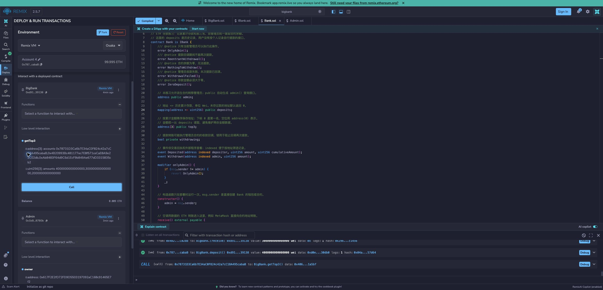
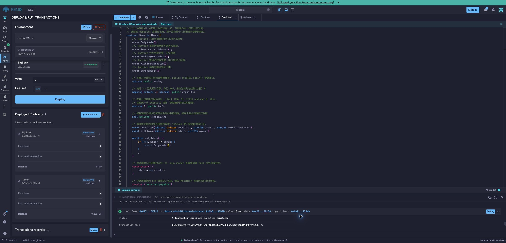

# 06 · BigBank：让一个合约管理另一个合约

在 [05 银行](../bank-05/README.md) 的基础上，这个练习增加存款门槛，并把提款权限交给 Admin 合约。重点是理解：钱包发起一笔交易后，下一层合约看到的调用者可能已经变了。

## 先用小明和管理员合约举例

小明部署 BigBank，小红部署 Admin。起初 `BigBank.admin = 小明`，`Admin.owner = 小红`。小明把 BigBank 管理员改成 Admin 地址后，只有 Admin 合约能向 BigBank 发起有效提款。

小红调用 `Admin.adminWithdraw(BigBank地址)`，Admin 再调用银行的 `withdraw()`。银行看到 `msg.sender = Admin`，因此通过权限检查；钱最后转入 **Admin 合约**。

当前 Admin 没有把钱再转给小红的接口，也没有代银行继续转移管理员的入口。请在 Remix VM 中学习，不把它当完整资金管理工具。

## 先认识三个语言概念

- **接口 IBank**：只写“这个对象有 `withdraw()`”，像一张可调用能力清单，不单独部署。
- **继承**：BigBank 使用 Bank 已有记账和排行榜，只补充门槛与管理员转移。
- **modifier**：函数执行前的检查。`minimumDeposit` 要求每笔金额严格大于 `0.001 ETH`。

因此存 `0.001 ETH` 失败，存 `0.001 ETH + 1 Wei` 才合格。之前存过很多钱，也不能免除本次门槛。

## 在 Remix VM 完成一次流程

导入 `contracts/` 的四个文件。用 Solidity `0.8.24`、目标 `shanghai`、关闭优化编译。选择 Remix VM；A～E 表示五个不同模拟账户。

1. A 部署 BigBank；E 部署 Admin。部署 Value 都是 `0 Wei`。
2. A 调 `BigBank.transferAdmin(Admin地址)`；查询 `admin()` 确认变更。
3. B 用 Value `1000000000000000 Wei` 调 `deposit()`，预期 `DepositTooSmall()`，状态不变。
4. B、C、D 分别存 `0.002`、`0.003`、`0.004 Ether`。预期银行有 `0.009 ETH`，排名 D、C、B。
5. Value 归零。A 直接调 BigBank 的 `withdraw()`，预期 `OnlyAdmin()`；A 调 Admin 的 `adminWithdraw`，预期 `OnlyOwner()`。
6. E 调 Admin 的 `adminWithdraw(BigBank地址)`。成功后 BigBank 为 0，Admin 为 `0.009 ETH`，历史记录与排名不变。

再用空 calldata 直接向 BigBank 转 `0.001 ETH`，同样应失败。两个入口都走被重写的 `_deposit()`，无法绕过门槛。

## 沿着代码跟一笔提款

```text
E 钱包 → Admin.adminWithdraw → IBank.withdraw
       → BigBank 继承的 Bank.withdraw → Admin.receive
```

[Admin.sol](contracts/Admin.sol) 先检查 E 是 owner；[Bank.sol](contracts/Bank.sol) 再检查调用者是 admin。两层各自检查自己的权限。最终的 `Received` 事件中，付款方是 BigBank，而不是 E。

[BigBank.sol](contracts/BigBank.sol) 的 `_deposit` 先检查门槛再 `super._deposit()`；[IBank.sol](contracts/IBank.sol) 让 Admin 不必了解排行榜实现。

自定义错误如 `DepositTooSmall()` 是失败类型；`revert` 才是终止并回滚的动作。错误不意味着存了一部分钱。收款失败同样整笔回滚，提款锁限制重入。

## 怎样确认学会了

能回答“Owner 点了提款，为什么 Owner 钱包没有增加 0.009 ETH？”答案是源码指定收款方为 Admin 合约。余额需分别查钱包、BigBank、Admin，不能只看一个地址。

本目录没有独立 Foundry 自动测试入口。上面的 Remix 步骤是当前可复现检查；2026-10-09 已本地编译 `contracts/`，没有重跑 Remix 交互；以下保留旧验证范围和截图。

## 历史验证记录

当前保留三个业务合约、一个 IBank 接口和 Remix 操作说明。已通过 Solidity `0.8.24` 编译及独立本地 EVM 验证：Bank 实现 IBank、Admin 参数为 IBank、8 类错误的返回标识、两个存款入口、拒收回滚和重入保护均通过。

当时还实际部署了新的 BigBank 和 Admin 本地实例，Admin 的 Owner 与 BigBank 部署者不同。先转移管理员，再由三个用户分别存入 `0.002`、`0.003`、`0.004 ETH`，最后由 Admin 的 Owner 通过 `adminWithdraw(IBank bank)` 提款，结果如下：

```text
提款前：BigBank = 0.009 ETH，Admin = 0 ETH
提款后：BigBank = 0 ETH，Admin = 0.009 ETH
历史存款：三个地址分别累计 0.002、0.003、0.004 ETH
排行榜：仍按 0.004、0.003、0.002 ETH 排列
```

临时校验脚本和本地交易记录位于仓库已忽略的 `output-tdd/bigbank-custom-errors/check.py`、`output-tdd/bigbank-custom-errors/workflow-result.json`，不属于项目依赖。模拟节点运行结束后关闭，这些地址和交易 Hash 不属于公共测试网。

### Remix 实际验证（2026-09-09）

以下地址、Gas 数值和截图对应新增 `Received` 事件之前的版本。要在 Remix 查看新版收款日志，需要重新编译并部署新的 BigBank、Admin，再按上面的流程操作；现有实例不会随源码更新。当时新增事件已通过本地 EVM 验证，覆盖钱包直接收款、银行提款的日志地址、发送方、金额及事件数量。

已在 Remix 2.5.7 的 `bigbank` 工作区完成页面部署和交互测试，环境为 **Remix VM Osaka**，编译器为 **0.8.24 / Shanghai / 关闭优化**。两份合约先部署，再转移管理员，然后由 Account 2、3、4 分别存款，最后由 Account 5 提款。查询 `getTop3()` 确认提款前后历史金额与排名一致。

```text
BigBank：0xd9145CCE52D386f254917e481eB44e9943F39138
Admin：  0x1bB5bf909d1200fb4730d899BAd7Ab0aE8487B0b
Owner：  0x617F2E2fD72FD9D5503197092aC168c91465E7f2（Account 5）
提款前： BigBank 0.009 ETH，Admin 0 ETH
提款后： BigBank 0 ETH，Admin 0.009 ETH
提款交易：0x9a96b6f92f53b73b29b18fb66f40df844dd26a0a652d392266841186627953eb
交易状态：1（成功），区块 12，交易消耗 46884 gas
```

页面上还验证了四类失败：零地址管理员 `InvalidAdmin`、两个存款入口恰好 `0.001 ETH` 时的 `DepositTooSmall`、原管理员直接提款的 `OnlyAdmin`、非 Owner 调用 Admin 的 `OnlyOwner`。当时 Remix 能直接显示错误名称及源码中对应的中文 `@notice` 说明，例如 `InvalidAdmin：新管理员不能是零地址。`；该展示依赖 Remix 的编译信息，不表示中文被写入错误返回数据。

这些地址与交易仅属于浏览器的 Remix VM，不属于公共测试网。拒收回滚、重入保护等验证仍来自前述本地 EVM 检查，当时没有在 Remix 重跑这些场景。





```sh
git status --short --untracked-files=all -- bigbank-06
git diff -- bigbank-06
```

新增文件在 `git add` 前不显示于普通 `git diff`，可通过 `git status` 列表逐个查看。本项目不需要提交或推送才能运行。

实现参考：[Solidity 0.8.24 modifier](https://docs.soliditylang.org/en/v0.8.24/contracts.html#function-modifiers)、[继承与重写](https://docs.soliditylang.org/en/v0.8.24/contracts.html#inheritance)。
