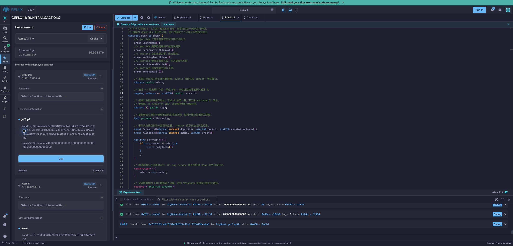
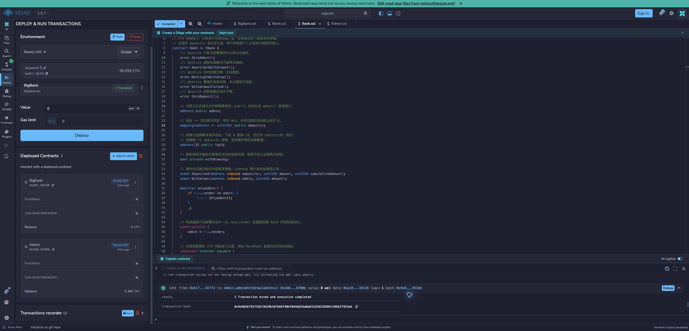

# BigBank：接口、继承、modifier 与合约管理员

在 [Bank 基础挑战](https://decert.me/quests/c43324bc-0220-4e81-b533-668fa644c1c3) 对应的银行练习之上，按补充题目实现接口、继承与合约管理员，独立于仓库已有的 `bank/`。使用 Solidity `0.8.24`，没有第三方合约依赖。在 Remix 中编译、部署和验证，本地目录只保存源码与说明。

## 题目与实现

- `Bank is IBank`：实现接口中的 `withdraw()`；`IBank` 只声明 Admin 需要的提款能力。
- `BigBank is Bank`：继承存款记账、累计存款前三名和管理员提款。
- 每次存款必须 **严格大于 `0.001 ether`**；`minimumDeposit` modifier 同时约束显式 `deposit()` 和直接转账的 `receive()`。
- 当前管理员调用 `transferAdmin(Admin 合约地址)`，将 BigBank 的管理权限交给 Admin。
- Admin 的部署者调用 `adminWithdraw(IBank bank)`，由 Admin 通过接口调用 BigBank 的 `withdraw()` 并接收全部 ETH。
- 按“部署两个合约 → 转移管理员 → 多用户存款 → Admin 的 Owner 提款”的顺序完成模拟。

```text
bigbank/
├── contracts/
│   ├── IBank.sol       # 接口：声明 withdraw()
│   ├── Bank.sol        # 基类：实现 IBank，记账、前三名、提款
│   ├── BigBank.sol     # 派生类：存款门槛、管理员转移
│   └── Admin.sol       # 管理合约：由 owner 发起提款并收款
├── screenshots/        # Remix 实际存款、提款验证截图
└── README.md
```

本项目的 Bank 沿用旧练习的代码，在本目录中独立维护。为支持继承扩展，`admin` 改为可更新变量，`_deposit()` 改为 `internal virtual`，提款权限检查复用 `onlyAdmin`。提款时保存收款地址，使回调期间管理员发生变化也不影响提款事件的收款人记录。

`Bank.withdraw()` 使用 `override` 实现 `IBank.withdraw()`。Admin 只导入 `IBank.sol`，不依赖 Bank 的具体实现；BigBank 继承 Bank，因此也满足 IBank。存款、记账和排行榜仍由具体合约提供，无需放入 Admin 不使用的接口中。

`IBank` 不单独部署。在 Remix 调用 `adminWithdraw()` 时，参数仍填写 BigBank 的合约地址；接口类型在 ABI 中编码为 `address`。

## 关键规则

`deposit()` 和 `receive()` 都进入 `_deposit()`；BigBank 只重写这一个共用记账路径，在执行父类记账前检查门槛，因此不会漏掉钱包直接转账。

```text
0 Wei                      → 拒绝
999999999999999 Wei         → 拒绝
1000000000000000 Wei        → 拒绝，恰好 0.001 ether
1000000000000001 Wei        → 接受，0.001 ether + 1 wei
2000000000000000 Wei        → 接受，0.002 ether
```

门槛检查的是每笔 `msg.value`，不是个人累计金额。Bank 基类仍接受任意正数存款，限制只由 BigBank 添加。`deposits(address)` 始终表示历史累计存入金额；提款不会清空历史或排行榜，同额排名保留已有顺序。

管理员与合约所有者是两个不同角色：

```text
部署后：BigBank.admin = BigBank 部署者
        Admin.owner   = Admin 部署者

转移后：BigBank.admin = Admin 合约地址

Admin.owner → Admin.adminWithdraw(IBank(BigBank 地址))
            → IBank.withdraw() → BigBank 继承的 Bank.withdraw()
            → ETH 转入 Admin.receive()
```

BigBank 的原管理员转移后不能再直接提款或转移权限。零地址不能成为管理员；非 Admin.owner 不能触发 `adminWithdraw()`；空余额提款会回退；收款失败会整体回滚，提款锁阻止重入。

本题的资金终点是 **Admin 合约**。当前 Admin 没有将 ETH 再转给 owner 或替 BigBank 再次转移管理员的接口；本项目按本地模拟练习使用。

`Admin.receive()` 发出 `Received(address indexed sender, uint256 amount)`，记录直接付款方和到账金额（Wei）。通过 `adminWithdraw()` 提款时，`sender` 是 BigBank 合约地址；钱包直接转入 ETH 时，`sender` 是钱包地址。成功提款的交易回执包含 Admin 的 `Received` 和 BigBank 的 `Withdrawn` 两条日志，展开 Remix 终端中的交易详情即可查看。Bank 的 `receive()` 已通过 `_deposit()` 发出 `Deposited`，无需重复发出存款事件。

## 自定义错误：怎么定义、怎么看

三个合约统一使用无参数自定义错误，不再用字符串报错。错误声明放在所属合约内部、函数外部；BigBank 自动继承 Bank 的错误，无需重复声明。只有多个没有继承关系的合约确实需要共享错误时，再考虑合约外定义。

```solidity
contract BigBank is Bank {
    /// @notice 新管理员不能是零地址。
    error InvalidAdmin();

    function transferAdmin(address newAdmin) external onlyAdmin {
        if (newAdmin == address(0)) {
            revert InvalidAdmin();
        }
        emit AdminTransferred(admin, newAdmin);
        admin = newAdmin;
    }
    // 其他代码省略
}
```

`error` 只定义错误类型；`revert InvalidAdmin()` 才会终止执行、回滚本次调用并返回错误数据。不能写成 `return "Invalid admin"`：当前函数没有返回值，而且 `return` 不是失败回滚。

当前错误与含义：

```text
Bank.OnlyAdmin()            只有当前管理员可操作
Bank.ReentrantWithdrawal()  提款期间发生重入
Bank.NothingToWithdraw()    合约余额为零
Bank.WithdrawalFailed()     管理员收款失败
Bank.ZeroDeposit()          Bank 存款金额为零
BigBank.InvalidAdmin()      新管理员是零地址
BigBank.DepositTooSmall()   BigBank 单笔存款不大于 0.001 ether
Admin.OnlyOwner()          只有 Admin 的部署者可发起提款
```

在 Remix 中查看错误：

1. 重新编译新版代码并在 Remix VM 部署新版合约。重新编译不会更新已部署的旧合约。
2. 在转移管理员之前，保持 BigBank 的部署者为当前账户、Value 为 `0 Wei`，调用 `transferAdmin(0x0000000000000000000000000000000000000000)`。
3. 展开底部终端中的失败调用详情。若当前界面已按对应 ABI 解码，可以看到 `InvalidAdmin()`；若只显示原始 `data`，此错误的数据为 `0xb5eba9f0`。

这 4 字节是 `keccak256("InvalidAdmin()")` 的前 4 字节，不是完整错误文字。ABI 中保存了错误名称和参数类型，工具据此解码；中文 `@notice` 注释用于源码与文档，不会自动成为钱包弹窗内容，也不会增加链上的错误返回数据。[Solidity 官方说明](https://docs.soliditylang.org/en/v0.8.24/contracts.html#errors-and-the-revert-statement)

使用 ethers v6 的程序可以这样解码原始错误数据；以下是独立使用示例，本项目无需安装 ethers：

```js
import { Interface } from "ethers"

const abi = ["error InvalidAdmin()"]
const iface = new Interface(abi)
const error = iface.parseError("0xb5eba9f0")
console.log(error?.name) // InvalidAdmin
```

实际项目传入编译器生成的 ABI 即可。如果通过 `Admin.adminWithdraw()` 收到 Bank 抛出的错误，需要使用包含该错误的 Bank/BigBank ABI；Admin 自己的 ABI 只声明 `OnlyOwner()`。`parseError` 找不到匹配错误时返回 `null`。[ethers 官方文档](https://docs.ethers.org/v6/api/abi/#Interface-parseError)

## 在 Remix VM 手动复现

以下账户名称按 Remix 2.5.7 界面的 `Account 1` 起算。新版界面先从合约的 Functions 下拉框选择函数，再点 `Call` 查询或 `Transact` 发交易；存款金额填写在该函数下方的 Value 中。

1. 打开 [Remix](https://app.remix.live/)，新建 `bigbank` 工作区，将 `contracts/` 中四个源码文件按相同目录导入。
2. 编译器选择 `0.8.24`，EVM 选择 `shanghai`，关闭优化。编译 `BigBank.sol` 和 `Admin.sol`。
3. Deploy & Run 中选择 **Remix VM → Osaka**，账户选 **Account 1**，Value 设为 `0 Wei`，部署 **BigBank**，记录地址。这里的 VM 版本与第 2 步的编译目标是两个不同设置。
4. 切换 **Account 5**，Value 保持 `0 Wei`，部署 **Admin**，记录地址。IBank 是接口，不部署；Bank 基类也无需单独部署。
5. 查询 BigBank 的 `admin()`，应为 Account 1；查询 Admin 的 `owner()`，应为 Account 5。这里故意使用不同账户，区分两种权限。
6. 切回 Account 1，在 BigBank 调用 `transferAdmin()`，参数填 **Admin 合约地址**。查询 `admin()`，应等于该合约地址。
7. 切换 Account 2，将 Value 设为 `1000000000000000 Wei`，调用 BigBank 的 `deposit()`，应报 `DepositTooSmall()`，余额仍为零。
8. Account 2 将 Value 改为 `2000000000000000 Wei`（`0.002 ether`），调用 `deposit()`，应成功。
9. 切换 Account 3，在 BigBank 的 **Low level interaction** 中保持 Calldata 为空。先用 `1000000000000000 Wei` 验证同样报 `DepositTooSmall()`，再用 `3000000000000000 Wei`（`0.003 ether`）点 `Transact`，触发 `receive()`，应成功。
10. 切换 Account 4，将 Value 设为 `4000000000000000 Wei`（`0.004 ether`），调用 `deposit()`，应成功。
11. 查询 `deposits(地址)` 和 `getTop3()`，个人累计分别为 `0.002`、`0.003`、`0.004 ether`；排名为 Account 4、3、2，BigBank 余额为 `0.009 ether`。
12. 函数下方的 Value 恢复为 `0 Wei`。Account 1 直接调用 BigBank 的 `withdraw()`，应报 `OnlyAdmin()`；Account 1 在 Admin 调用 `adminWithdraw(BigBank 地址)`，应报 `OnlyOwner()`。
13. 切回 **Admin 的 Owner：Account 5**，在 Admin 调用 `adminWithdraw()`，参数填 BigBank 地址。应成功：BigBank 余额归零，Admin 余额变为 `0.009 ether`，个人历史和排行榜保留。

Owner 是发起提款的人，资金接收方是 **Admin 合约地址**，不是 Owner 钱包。最小合格存款 `1000000000000001 Wei` 的边界已在本地校验；如额外在 Remix 存入该金额，应同步调整预期总额。

## 验证记录与范围检查

当前保留三个业务合约、一个 IBank 接口和 Remix 操作说明。已通过 Solidity `0.8.24` 编译及独立本地 EVM 验证：Bank 实现 IBank、Admin 参数为 IBank、8 类错误的返回标识、两个存款入口、拒收回滚和重入保护均通过。

本次还实际部署了新的 BigBank 和 Admin 本地实例，Admin 的 Owner 与 BigBank 部署者不同。先转移管理员，再由三个用户分别存入 `0.002`、`0.003`、`0.004 ETH`，最后由 Admin 的 Owner 通过 `adminWithdraw(IBank bank)` 提款，结果如下：

```text
提款前：BigBank = 0.009 ETH，Admin = 0 ETH
提款后：BigBank = 0 ETH，Admin = 0.009 ETH
历史存款：三个地址分别累计 0.002、0.003、0.004 ETH
排行榜：仍按 0.004、0.003、0.002 ETH 排列
```

临时校验脚本和本地交易记录位于仓库已忽略的 `output-tdd/bigbank-custom-errors/check.py`、`output-tdd/bigbank-custom-errors/workflow-result.json`，不属于项目依赖。模拟节点运行结束后关闭，这些地址和交易 Hash 不属于公共测试网。

### Remix 实际验证（2026-09-09）

以下地址、Gas 数值和截图对应新增 `Received` 事件之前的版本。要在 Remix 查看新版收款日志，需要重新编译并部署新的 BigBank、Admin，再按上面的流程操作；现有实例不会随源码更新。本次新增事件已通过本地 EVM 验证，覆盖钱包直接收款、银行提款的日志地址、发送方、金额及事件数量。

已在 Remix 2.5.7 的 `bigbank` 工作区完成页面部署和交互测试，环境为 **Remix VM Osaka**，编译器为 **0.8.24 / Shanghai / 关闭优化**。两份合约先部署，再转移管理员，然后由 Account 2、3、4 分别存款，最后由 Account 5 提款。查询 `getTop3()` 确认提款前后历史金额与排名一致。

```text
BigBank：0xd9145CCE52D386f254917e481eB44e9943F39138
Admin：  0x1bB5bf909d1200fb4730d899BAd7Ab0aE8487B0b
Owner：  0x617F2E2fD72FD9D5503197092aC168c91465E7f2（Account 5）
提款前： BigBank 0.009 ETH，Admin 0 ETH
提款后： BigBank 0 ETH，Admin 0.009 ETH
提款交易：0x9a96b6f92f53b73b29b18fb66f40df844dd26a0a652d392266841186627953eb
交易状态：1（成功），区块 12，交易消耗 46884 gas
```

页面上还验证了四类失败：零地址管理员 `InvalidAdmin`、两个存款入口恰好 `0.001 ETH` 时的 `DepositTooSmall`、原管理员直接提款的 `OnlyAdmin`、非 Owner 调用 Admin 的 `OnlyOwner`。本次 Remix 能直接显示错误名称及源码中对应的中文 `@notice` 说明，例如 `InvalidAdmin：新管理员不能是零地址。`；该展示依赖 Remix 的编译信息，不表示中文被写入错误返回数据。

这些地址与交易仅属于浏览器的 Remix VM，不属于公共测试网。拒收回滚、重入保护等验证仍来自前述本地 EVM 检查，本次没有在 Remix 重跑这些场景。





```sh
git status --short --untracked-files=all -- bigbank
git diff -- bigbank
```

新增文件在 `git add` 前不显示于普通 `git diff`，可通过 `git status` 列表逐个查看。本项目不需要提交或推送才能运行。

实现参考：[Solidity 0.8.24 modifier](https://docs.soliditylang.org/en/v0.8.24/contracts.html#function-modifiers)、[继承与重写](https://docs.soliditylang.org/en/v0.8.24/contracts.html#inheritance)。
