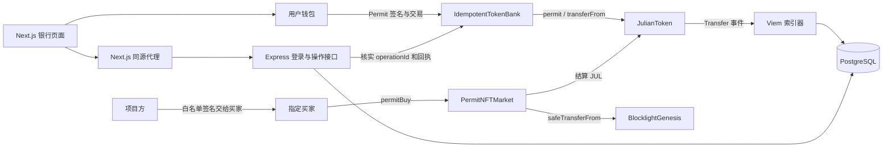

# EIP-712 全栈：Permit 存款与白名单 NFT

这是本练习的统一入口。现有实现已集中到本目录，安装、编译、运行、测试和复习均从这里开始。先读 [AGENTS.md](AGENTS.md)，按 [WALKTHROUGH.md](WALKTHROUGH.md) 执行完整命令行流程；请求、登录、幂等与恢复细节见 [REQUESTS.md](REQUESTS.md)。

## 目标与已实现范围

- `JulianToken`：OpenZeppelin EIP-2612 ERC20Permit，名称 `Julian Token`，符号 `JUL`，18 位精度，部署者一次获得 1,000,000 JUL。
- `IdempotentTokenBank`：普通存款、Permit 存款、提款和操作编号去重，三个入口均防重入；直接转币到银行不会增加个人可提余额。
- 原 TokenBank 全栈页面：保留钱包连接、精确金额、三种余额、历史索引、SIWE 登录、终止与恢复，增加“签名授权 / 普通授权”。UI 延用 Tailwind，参考 Uniswap 的中央卡片、分层输入区和粉色主按钮。
- `BlocklightGenesis`：复用已有 `Blocklight Genesis / BLGT` ERC721，owner 铸造，tokenId 从 0 开始。
- `PermitNFTMarket`：项目方签署 EIP-712 白名单，指定买家凭签名购买指定订单；继承的普通购买和回调购买入口均禁用。NFT 铸造、上架和购买提供命令行演示与自动测试，前端专注银行页面。

题目来源：[TokenBank](https://decert.me/challenge/eeb9f7d8-6fd0-4c38-b09c-75a29bd53af3)、[TokenBank 前端](https://decert.me/quests/56e455b3-901c-415d-90c0-a20759469cf9)、[NFTMarket](https://decert.me/challenge/5f11aa15-b101-480b-91b5-4888b9aafdbb)、[参考分支](https://github.com/lbc-team/TokenBank/tree/tokenbank-eip712)。题面依据用户提供的原文；此前未能读取课程站点和参考分支，不声称逐行复现。标准：[EIP-2612](https://eips.ethereum.org/EIPS/eip-2612)、[EIP-712](https://eips.ethereum.org/EIPS/eip-712)；UI 参考：[Uniswap](https://app.uniswap.org/)。

## 复用来源与目录

本次复用已有业务实现并集中保存，没有重新编写一套业务。历史 `08/11/13` 仍保留各自练习，Permit 后续维护以本目录为准；运行时不导入它们的源码，也不复制它们的 `.env`、部署状态、数据库或构建产物。

```text
eip712-permit-16/
├── contracts/
│   ├── src/
│   │   ├── JulianToken.sol            本题的 EIP-2612 Token
│   │   ├── IdempotentTokenBank.sol    从 13 复用，增加 Permit
│   │   ├── NFTMarket.sol              从 08 复用上架与结算
│   │   ├── PermitNFTMarket.sol        本题的白名单市场扩展
│   │   ├── BlocklightGenesis.sol      从 11 复用 NFT
│   │   ├── BaseERC20.sol              从 13 保留普通授权回归用 Token
│   │   └── TokenBank.sol              从 13 保留旧银行兼容测试
│   ├── test/                         普通银行、幂等与签名测试
│   └── foundry.toml
├── frontend/                         从 13 复用 Next.js / Wagmi 页面
│   ├── app/                          页面、Provider、同源 API
│   ├── domains/                      银行、钱包、操作、转账记录
│   ├── features/                     页面布局与操作工作区
│   ├── shared/                       请求队列、代理、通知
│   ├── scripts/                      本地部署与白名单 typed data
│   └── tests/                        单元、普通 RPC、Permit / NFT RPC
├── backend/                          从 13 复用 Express / Viem
│   ├── src/operations/               SIWE、操作登记与链上核实
│   ├── src/transfers/                索引、重组恢复、查询
│   └── test/                         PostgreSQL、HTTP 与全栈集成
├── database/                         从 13 复用 schema.sql / verify.sql
├── README.md                         范围、架构、阅读与验证入口
├── WALKTHROUGH.md                    从零运行、CLI 交易、查询与恢复
└── REQUESTS.md                       请求、认证、幂等与失败边界
```

只有两类仓库级依赖仍共享：`foundry-counter-09/lib` 中已有 OpenZeppelin / forge-std，以及 `multi-chat-py-01/web/.husky` 提交钩子。因此应在完整仓库内使用，不把本目录单独拷出后当作已包含依赖的发行包。未新增依赖或升级版本；前端 pnpm、后端 npm，各自保留原锁文件。

## 整体调用关系



钱包余额、个人存款与银行总资产以合约为准。数据库保存事件、会话及操作状态，不决定谁可提款。链上交易成功、后端核实成功、索引完成和页面刷新是不同阶段。

### 三种签名不要混淆

1. **SIWE 登录**：用户证明账户身份，让后端登记/核实操作；不授权 Token，不扣款。首次登录或会话过期时需要。
2. **Token Permit**：Token 持有人授权银行使用本次金额，域为 `Julian Token / 1 / chainId / Token 地址`。钱包签名免费，随后 `permitDeposit` 仍是一笔需要 Gas 的链上交易。
3. **NFT 白名单**：项目方批准指定买家购买订单，域为 `Julian NFT Market / 1 / chainId / Market 地址`。它不等于 Token 付款授权，买家仍需给市场足够 allowance。

```solidity
Permit(address owner,address spender,uint256 value,uint256 nonce,uint256 deadline)
Whitelist(address buyer,address seller,uint256 tokenId,uint256 price,uint256 nonce,uint256 deadline)
```

签名存款流程：保存 operationId → SIWE / 后端登记 → 读取 Token nonce → 钱包签署 20 分钟有效的 Permit → 模拟 → 发送 `permitDeposit(amount, operationId, deadline, v, r, s)` → 账本记账 → 后端核实 → 索引与页面刷新。

普通与签名存款使用相同编号和金额只产生一次资金效果；参数冲突回滚。编号重放先于签名验证，已完成的操作无需重新消费 Token nonce。若 Permit 已被他人提前提交，银行可以继续使用已有 allowance；任何人不能凭他人签名把钱记给自己。

白名单购买流程：seller 铸造 NFT → approve 市场 → list → 项目方签署 buyer、seller、tokenId、price、nonce、deadline → buyer approve JUL → permitBuy → nonce 加一 → 清除挂单 → JUL 给 seller，NFT 给 buyer。任一步失败时整笔回滚。撤单不永久撤销未使用签名，相同条件在有效期内重新上架仍可接受它。

## 推荐阅读顺序

1. [Token](contracts/src/JulianToken.sol) → [银行](contracts/src/IdempotentTokenBank.sol) → [Permit 银行测试](contracts/test/PermitTokenBank.t.sol)。
2. [市场基类](contracts/src/NFTMarket.sol) → [白名单扩展](contracts/src/PermitNFTMarket.sol) → [NFT](contracts/src/BlocklightGenesis.sol) → [市场测试](contracts/test/NFTMarket.t.sol)。
3. [银行客户端](frontend/domains/bank/client.ts) → [操作编排](frontend/domains/operations/client.ts) → [页面工作区](frontend/features/bank-workspace.tsx)。
4. [后端操作核实](backend/src/operations/chain.ts) → [索引器](backend/src/transfers/indexer.ts) → [表结构](database/schema.sql)。
5. [本地部署](frontend/scripts/permit-local.ts) → [签名数据](frontend/scripts/whitelist.ts) → [RPC 测试](frontend/tests/permit.integration.mts) → [全栈测试](backend/test/fullstack.integration.ts)。

## 最短验证路径

从仓库根目录进入本项目，之后命令均在本项目根目录执行：

```bash
cd /Users/julian/Documents/Codex/2026-09-03/block-chain-list/eip712-permit-16
pnpm --dir frontend install --frozen-lockfile
npm --prefix backend ci
forge test --root contracts -vvv
pnpm --dir frontend test:permit
TEST_PERMIT=1 npm --prefix backend run test:integration
```

最后一项需要 PostgreSQL，使用随机 schema 和独立 Anvil，结束自动清理。前两项交易测试无需人工钱包签名或公共 RPC。全套质量检查、资产转移日志生成和浏览器运行命令见 [操作指南](WALKTHROUGH.md)。

## 限制

- 仅演示本地 EVM / Anvil，没有本次公共链部署或课程提交。旧部署不能因源码迁移自动升级。
- 标准无手续费、无 rebase Token；前端 Permit version 固定为本项目的 `1`。签名面向 EOA，没有 ERC-1271。
- SIWE、Token nonce、白名单 nonce、operationId 分别负责不同权限与去重，不可互相替代。签名不保存在浏览器恢复记录。
- 索引器只索引 JUL 的 Transfer；NFT 转移用回执、`ownerOf` 和测试断言核对，未新增 NFT 数据库索引或交易页面。
- 测试 NFT URI 是占位值；本次不上传 IPFS。历史 11 题的媒体与部署证据仍留在原目录。
- 终止请求只停止等待和后续步骤，不能撤回已广播交易；恢复必须先核实原 operationId / 哈希。

## 最新 Review 与实测（2026-09-23）

题目要求的两点均已实现，并在本轮重新执行：

1. **存款成功测试**：[Foundry 用例](contracts/test/PermitTokenBank.t.sol) 验证无需预先 approve 的 Permit 存款，断言用户余额减少、银行资产和个人存款增加；[RPC 用例](frontend/tests/permit.integration.mts) 调用真实银行客户端，另断言只广播一笔存款交易及回执的 ERC20 Transfer。
2. **NFT 购买成功测试及转移证据**：[Foundry 用例](contracts/test/NFTMarket.t.sol) 和上述 RPC 用例均验证 buyer 付款、seller 收款、NFT owner 变更；RPC 用例同时解码并断言 ERC20 / ERC721 Transfer 的 from、to、value / tokenId。

本轮 RPC 日志中的实际结果（JUL 为 18 位精度）：

```text
Permit 存款 10.000000000000000001 JUL：
buyer 钱包：1000 → 989.999999999999999999
银行资产 / buyer 存款：0 → 10.000000000000000001
ERC20 Transfer：buyer → bank，value = 10000000000000000001

白名单购买 Blocklight Genesis #0：
ERC20 Transfer：buyer → seller，value = 100000000000000000000（100 JUL）
ERC721 Transfer：seller → buyer，tokenId = 0
ownerOf(0) = buyer，白名单 nonce = 1
```

两笔交易的本地哈希、完整地址、余额及解码事件保存在 [RPC 原始日志](../output-tdd/eip712-review/permit-integration.log)。[Foundry Transfer 轨迹](../output-tdd/eip712-review/transfers.log) 展示合约调用和事件；这两份日志即可证明本地模拟中的 Token / NFT 转移，不依赖截图。

Review 修复及精简：

- 修复共享代理默认端口 `3001 → 13016`，避免未设置 `INDEXER_URL` 时连到旧项目；补入默认地址回归检查，已验证修复前失败、修复后通过。
- 修复测试清理：Anvil 启动后立即独立注册回收，数据库配置/清理异常不会跳过节点回收；节点已退出时不再等待第二次 exit。无效 `DATABASE_URL` 的异常路径已实测，无遗留 Anvil。
- 删除银行客户端 3 处重复账户/网络检查；保留读取开始/结束、签名前后及统一广播入口的校验。拒签、切换账户/链、取消后停止及晚返回哈希的测试继续通过。
- 保留普通 Token、旧银行兼容用例和市场基类：它们分别承担回归与实际复用职责；未新增框架、依赖或通用抽象。

完整自动流程已通过 [Approve 日志](../output-tdd/eip712-review/fullstack-approve.log) 和 [Permit 日志](../output-tdd/eip712-review/fullstack-permit.log)：部署合约 → SIWE 登录 → 后端登记 → 页面实际 `executeIntent` 编排 → 签名/授权 → 存款 → 丢失哈希后按原编号恢复且不重复广播 → 提款 → PostgreSQL 索引 → 同源代理查询。另覆盖并发去重、重组后的重新核实和过期 Permit 回滚。

本轮验证：20 项合约测试（含 256 次 fuzz）、前端 12 项单元测试及 2 项 RPC 集成、后端 4 项测试及 Approve / Permit 两种全栈集成全部通过；前后端 lint、格式、严格类型检查及生产构建通过。因原目录开发服务正在运行，生产构建使用相同源码与依赖的隔离副本；在 `3017` 验证了未连接页面、钱包弹窗、存入/取出切换，控制台无错误。未操作现有 `8547` / `3016` 服务。

[共享 pre-commit](../output-tdd/eip712-review/hook.log) 已用临时 Git index 实跑通过，真实暂存区未改变。文档本地链接及 Bash / Zsh 命令语法通过；测试节点、临时 schema 和本轮生产预览已清理。其他检查日志：[合约](../output-tdd/eip712-review/forge-test.log)、[前端](../output-tdd/eip712-review/frontend-quality.log)、[后端](../output-tdd/eip712-review/backend-quality.log)、[生产构建](../output-tdd/eip712-review/build.log)、[异常清理](../output-tdd/eip712-review/cleanup-check.log)。

完整交易自动化使用真实本地 Anvil、PostgreSQL 和 Express；Node 适配器只补浏览器 origin/cookie，并调用真实 Next Route Handler。**没有使用真实钱包扩展人工点击签名，也没有公共链交易**，浏览器验收范围是未连接状态。原始日志在忽略的 `output-tdd/eip712-review/`，复现命令见 [操作指南第 9 节](WALKTHROUGH.md#9-全套验证与作业日志)。

## 历史整合记录（本轮 Review 前）

2026-09-23，Node.js 24.14.0、Foundry 1.8.1、Solc 0.8.24，在本目录执行并通过：

- 20 项合约测试（含 256 次 fuzz）、前端 12 项单元测试与 2 项 RPC 集成、后端 4 项单元/数据库测试与 Approve / Permit 两种全栈集成。
- 前后端 lint、格式与严格类型检查，前端生产构建，共享 pre-commit。钩子用临时 Git index 验证，真实暂存区未改变。整合目录的生产页面在浏览器未连接状态正常渲染，无控制台错误。
- 直接执行操作指南中的本地部署、项目方签名、模拟和白名单购买命令：buyer 支付 100 JUL 后持有 NFT #0，余额 900 JUL、市场 nonce 为 1。
- 停止并重新加载本地 Anvil 状态后，NFT owner、JUL 余额、nonce 与购买回执仍可读取。文档命令通过 Bash / Zsh 语法检查，所有本地文档链接有效。

证据位于本地忽略目录，克隆后按操作指南生成：

- [合约测试](../output-tdd/eip712-consolidate/forge-test.log)、[Token / NFT Transfer 轨迹](../output-tdd/eip712-consolidate/transfers.log)。
- [Permit RPC 测试](../output-tdd/eip712-consolidate/permit-integration.log)、[全栈 Permit 测试](../output-tdd/eip712-consolidate/fullstack-permit.log)。
- [文档命令实测](../output-tdd/eip712-consolidate/cli-demo.log)、[状态恢复核对](../output-tdd/eip712-consolidate/restore-check.json)、[构建](../output-tdd/eip712-consolidate/build.log)、[共享钩子](../output-tdd/eip712-consolidate/hook.log)。

本次验证不包含真实钱包扩展的人工签名，也未运行公共链交易。文档演示留下的本地部署与状态在 `output-tdd/eip712-consolidate/demo/`，NFT #0 已成交；本轮未为这个手工演示创建持久数据库，后端全栈测试使用的是已清理的临时 schema。要继续演示银行页面，先恢复这条链，再按操作指南首次创建数据库并启动前后端；不要重复部署 NFT。
