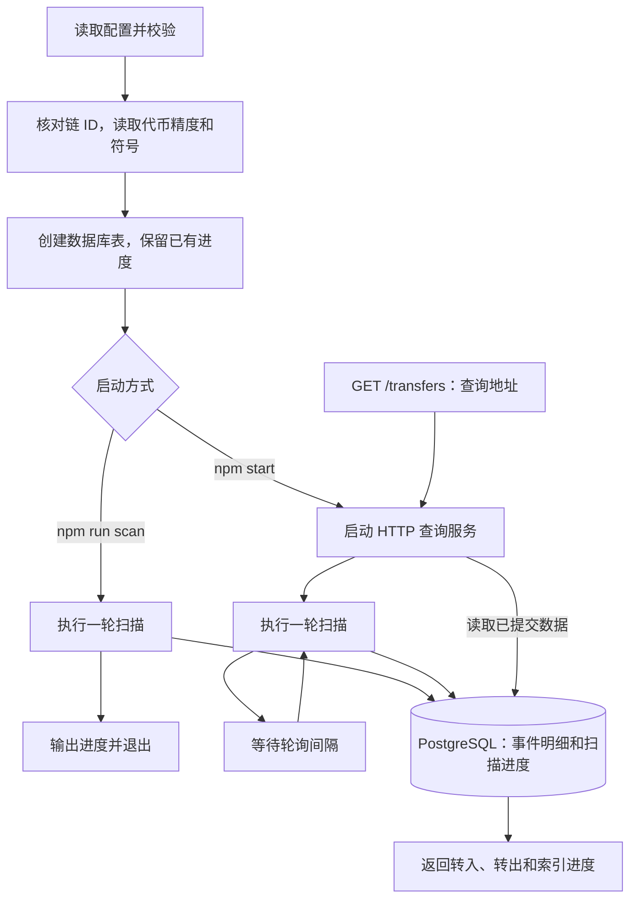

# ERC20 转账事件索引作业

完成《W3_D4 索引合约事件》第 30 页作业：索引自己发行的 ERC20 转账，记录到数据库，并通过 REST 接口查询某个地址的转账记录。

[作业链接](https://learnblockchain.cn/quest/ae220513-c0cb-4d9b-873a-caee1d4b358e)

使用 Express 5、Viem 和本机 PostgreSQL，不需要重新部署合约。Express 管理路由和中间件，Viem 读取链上事件，`pg` 访问数据库。

需要连同钱包和前端一起验收时，参照 [Token Bank 完整实操流程](../tokenbankv2/frontend/WALKTHROUGH.md)，从本地合约部署、测试资产准备到 API 和数据库核对逐步执行。

## 代码结构

```text
src/
├── main.mjs              启动、扫描轮询、退出清理
├── config.mjs            环境变量解析和配置校验
├── database.mjs          建表、按地址查询转账
├── indexer.mjs           分批扫块、事务入库、检查点和重组恢复
├── app.mjs               Express 应用、路由挂载、统一错误响应
└── routes/
    └── transfers.mjs     转账接口：方法检查、参数校验、响应格式化
test/
├── config.test.mjs       配置默认值、覆盖值和非法输入
├── api.test.mjs          HTTP 参数、方法及错误处理
└── indexer.test.mjs      真实数据库中的扫描与 HTTP 查询闭环
```

启动入口组装各模块；索引器负责写入事件和进度，接口通过数据库查询函数读取结果。HTTP 路由中不编写 SQL，索引器也不处理 HTTP 请求。

## 使用已有代币

默认值来自仓库 `foundry-counter/broadcast/MyToken.s.sol/11155111/run-latest.json`：

```text
网络：Sepolia
Chain ID：11155111
代币：My Token / MTK
精度：18
合约：0xaa0ce32d799459b6a617a0c07cfc79b4048e4dbc
部署区块：11702875
部署者：0x000071424bb08b910f0786e04d964a63d64bf1ba
部署交易：0x9bb455eae5ad7ff81fba3888cd4cb5c63ec3b58c0fac44474c01f32c894d1da5
```

## 启动

需要 Node.js 22.13+、npm 和 PostgreSQL。当前机器的 PostgreSQL 16 已在 `127.0.0.1:5432` 运行，独立数据库 `erc20_indexer` 已创建。

```bash
cd /Users/julian/Documents/Codex/2026-09-03/block-chain-list/erc20-event-indexer
npm ci
npm start
```

新机器首次运行，先用 PostgreSQL 的 `createdb erc20_indexer` 创建数据库。默认使用当前系统用户名连接；程序启动时自动建表。终端显示 `Indexed through block ...` 表示该轮扫描成功，按 Ctrl+C 停止。重启会从数据库保存的进度继续。

只补齐历史、完成后退出：

```bash
npm run scan
```

需要修改配置时：

```bash
test -f .env || cp .env.example .env
```

修改 `.env` 中的 `PGHOST`、`PGPORT`、`PGDATABASE`，也可设置 `PGUSER`、`PGPASSWORD` 或 `DATABASE_URL`；该文件已被 Git 忽略。换代币时同时设置正确的 `RPC_URL`、`CHAIN_ID`、`TOKEN_ADDRESS`、`START_BLOCK`。同一链和合约的起始区块一旦存入数据库，就不能直接修改；需要重建索引时使用另一个独立数据库。

`CONFIRMATIONS=12` 表示只扫描到最新高度减 12；`BATCH_SIZE=2000` 表示每批最多 2,000 块；`POLL_INTERVAL_MS=12000` 表示每轮完成后等 12 秒再扫描。RPC 限制较小时可减小批次。服务默认只监听本机 `127.0.0.1:3001`。

## 查询接口

```bash
curl --fail --silent --show-error \
  'http://127.0.0.1:3001/transfers?address=0x000071424bb08b910f0786e04d964a63d64bf1ba&limit=50&offset=0'
```

`GET /transfers` 参数：

- `address`：必填，Ethereum 地址，同时查询转入与转出，自转账只返回一次。
- `limit`：默认 50，允许 1～100。
- `offset`：默认 0，非负整数。

地址和分页参数各传一个值；重复的 `address`、`limit` 或 `offset` 返回 400。Express 负责解析查询参数，校验中间件将通过检查的数据保存在本次请求的 `res.locals.transferQuery` 中。

结果按区块高度和日志序号倒序排列。新转账插入时 offset 分页的位置会移动，适合本作业的手动查询。

响应示例（`indexedThrough` 随扫描推进）：

```json
{
  "chainId": 11155111,
  "tokenAddress": "0xaa0ce32d799459b6a617a0c07cfc79b4048e4dbc",
  "symbol": "MTK",
  "decimals": 18,
  "address": "0x000071424bb08b910f0786e04d964a63d64bf1ba",
  "indexedThrough": "11729165",
  "limit": 50,
  "offset": 0,
  "transfers": [
    {
      "blockNumber": "11702875",
      "blockHash": "0x5678988e06442d87718583a4a88ae1e399d62663211180a85372b79cb62ee93a",
      "transactionHash": "0x9bb455eae5ad7ff81fba3888cd4cb5c63ec3b58c0fac44474c01f32c894d1da5",
      "logIndex": 9119,
      "fromAddress": "0x0000000000000000000000000000000000000000",
      "toAddress": "0x000071424bb08b910f0786e04d964a63d64bf1ba",
      "valueRaw": "10000000000000000000000000000",
      "value": "10000000000"
    }
  ]
}
```

`valueRaw` 为链上整数，数据库使用 `numeric(78,0)`；`value` 按合约 `decimals()` 格式化。两者均返回字符串，避免 JavaScript Number 丢失精度。铸币和销毁也是 Transfer：零地址分别是发送方或接收方。

未找到记录时返回 HTTP 200 和空数组；参数错误为 400，路径不存在为 404，非 GET 为 405，数据库失败为 500。服务启动后先开放查询，历史扫描在后台进行；应结合 `indexedThrough` 判断当前覆盖范围，尚未初始化扫描进度时为 `null`。

## 实现对应课件



- `main.mjs → config.mjs`：加载并校验配置。
- `main.mjs → database.mjs`：创建表，保留历史记录。
- `main.mjs → indexer.mjs`：扫描、保存事件与进度。
- `main.mjs → app.mjs → routes/transfers.mjs → database.mjs`：启动 API 并响应查询。

每批记录和进度在同一个事务内提交。日志主键包含链、合约、交易哈希和日志序号：重复扫描不会重复入库，一笔交易中的多条事件也不会相互覆盖。扫描行使用数据库行锁，避免两个进程同时推进同一个检查点。

保存检查点区块哈希，读取日志前后核对链状态。发现已存区块被替换时，仅清除此链此代币的记录，从部署区块重扫；重扫期间查询可能暂时不完整。12 块确认是学习用参数，不等同于最终性保证。当前采用全量重扫的简单恢复策略，适用于作业规模。

### 按什么顺序阅读代码

1. 从 `src/main.mjs` 开始：调用 `loadConfig` → 创建客户端 → 核对网络和代币 → 调用 `initDatabase`。配置检查在 `src/config.mjs`，建表在 `src/database.mjs`；数据库本身需要事先存在。
2. 接着看 `src/indexer.mjs` 的 `scanOnce`：恢复进度 → 确定确认高度 → 按批读取事件 → 保存明细和进度。
3. 最后看 `src/app.mjs` 的 `createApp` 和 `src/routes/transfers.mjs`：Express 匹配路由 → 校验查询参数 → 调用 `findTransfers` → 格式化金额 → 返回 JSON，再用测试文件中的 Alice/Bob 数据核对结果。

`npm run scan` 只执行一轮，追到这一轮开始时的确认高度后退出。`npm start` 则先开放接口，再串行执行“扫描 → 等待 → 扫描”；等待 RPC/数据库时仍可处理 HTTP 查询。出现扫描错误时保留已提交进度，下轮重试。按 Ctrl+C 会停止安排下一轮并打断等待，正在执行的扫描会先结束，再关闭 HTTP 服务和连接池。

### 一轮扫描内部发生什么

1. **恢复进度**：按 `chain_id + token_address` 找到 `scan_progress`；首次运行把 `next_block` 设置成部署块，重启时保留原值。
2. **确定上限**：`target = head - confirmations`。这一轮固定上限，新产生的区块留给下一轮。
3. **开始一批事务**：借用同一数据库连接执行 `BEGIN`，用 `FOR UPDATE` 锁住进度行，防止多个扫描进程同时推进同一进度。
4. **检查旧历史**：`block_hash` 属于 `next_block - 1`。若它与 RPC 当前看到的链不一致，清除此链此代币的明细并重置进度，再从部署块重扫。
5. **读取本批事件**：计算闭区间 `[fromBlock, toBlock]`，用 `getLogs` 限定代币地址和 Transfer 事件，Viem 解码出 `from`、`to`、`value`。读取后再次核对批次末块和旧检查点的哈希。
6. **写入并提交**：逐条插入日志；遇到相同主键就跳过。把 `next_block` 改为 `toBlock + 1`，保存末块哈希，然后 `COMMIT`。没有事件的批次也要推进进度。
7. **完成或重试**：扫描超过本轮上限就返回；批次失败则 `ROLLBACK`，释放连接并交给调用方处理。常驻模式下，下轮从失败批次重新开始；单次模式下，进程以失败状态退出，修复问题后重新执行即可。

### 用三个批次理解断点续扫

以下数字仅用于演示，实际部署区块仍以配置为准：

```text
startBlock = 100
head = 110
confirmations = 2
batchSize = 3
本轮扫描上限 target = 108

第一批：100～102 → 保存事件 → next_block = 103 → COMMIT
第二批：103～105 → 保存事件 → next_block = 106 → COMMIT
第三批：106～108 → 保存事件 → next_block = 109 → COMMIT
结束：109 > 108，返回 indexedThrough = 108
```

如果第二批插入第一条事件后，下一条写入失败，整个第二批会回滚：第一批保留，`next_block` 仍为 `103`。重试从 `103` 开始，不会跳过失败区间，也不会保留半批数据。若进程在数据库已经提交后退出，重启会直接读取提交后的进度。

重组是另一种情况：同一高度对应的区块哈希变了，旧明细可能已经失效。程序会同时清除本代币明细并把进度重置为 `start_block`，提交后重新扫描，而不是仅靠重复日志去重处理。

### 一次地址查询如何返回

在另一个终端执行前面的 curl 示例。Express 匹配 `/transfers` 后，依次执行方法检查、`validateTransferQuery` 和异步处理函数。参数通过校验后，`database.mjs` 的 `findTransfers` 在一条 SQL 中同时取出本页明细和扫描进度。

数据库条件是 `from_address = 查询地址 OR to_address = 查询地址`。例如 Alice 转给 Bob，查 Alice 能看到转出，查 Bob 能看到转入；Alice 转给自己只对应一行，不会返回两次。结果按 `block_number DESC, log_index DESC` 排序，再应用 `limit` 和 `offset`。

从数据库读到的 `value_raw` 转成 `bigint` 后，交给 `formatUnits(valueRaw, decimals)` 格式化成字符串。这个过程不经过 JavaScript `Number`，因此大额整数不会被四舍五入。接口只查询已经提交的数据；扫描尚未追上链头时，`indexedThrough` 会落后，空数组也只能说明当前索引中没有匹配记录。

可以在 `erc20_indexer` 数据库里执行以下只读 SQL，对照接口中的进度：

```sql
SELECT
    chain_id,
    token_address,
    start_block,
    next_block,
    next_block - 1 AS indexed_through,
    block_hash AS checkpoint_hash
FROM scan_progress
WHERE chain_id = 11155111
  AND token_address = '0xaa0ce32d799459b6a617a0c07cfc79b4048e4dbc';
```

其中 `next_block` 是下一次要读取的区块，`indexed_through` 是该进度前的最后一个高度。刚创建进度、尚未完成第一批时，它等于 `start_block - 1`，且 `checkpoint_hash` 为 `NULL`。

### 后续增加校验与鉴权的位置

```text
客户端请求
  → app.mjs：挂载公共中间件、鉴权中间件（接入鉴权时添加）
  → routes/transfers.mjs：检查方法、校验参数
  → database.mjs：参数化查询
  → routes/transfers.mjs：格式化金额、返回 JSON
  → app.mjs：捕获未处理异常，返回统一错误响应
```

当前没有启用身份鉴权。确定采用 API Key、JWT 或 Session 后，在 `app.mjs` 的转账路由挂载前加入对应的真实校验中间件：凭据缺失或无效返回 401，权限不足返回 403，验证通过才调用 `next()` 进入后续路由。身份鉴权放在路由入口，字段格式和范围检查保留在各接口的校验中间件中。

新增接口时，在 `routes/` 中创建对应路由并在 `app.mjs` 挂载；新增字段校验时修改该路由的校验中间件。Express 5 会把异步处理函数抛出的错误交给统一错误中间件，不需要为每条路由复制 `try/catch`。当前数据库异常返回原有的 500 JSON，不向客户端暴露连接信息或堆栈。

客户端仍使用 HTTP GET / fetch / curl 调用。Express 不会自动开放跨域：浏览器前端与 API 使用不同来源时，应在 `app.mjs` 按实际前端来源配置 CORS，或通过开发代理使用同一来源。

## 验证

```bash
npm test
npm run lint
npm run format:check
```

扫描集成测试在独立、随机命名的 schema 中运行并清理，保留 `public` 中的真实扫描记录。覆盖转入/转出、自转账、同交易多日志、重复日志、大额精度、零金额、分页与无效参数、断点续扫、RPC 失败、数据库事务回滚，以及重组恢复。API 测试另行验证重复参数、方法限制、异步错误响应和内部信息隐藏；配置测试验证启动前的输入检查。

采用仓库现有 Husky 钩子，新增本目录变更时运行 lint-staged + Biome 和本作业测试，并保留原有 Web 项目的检查。JavaScript 使用 `asNeeded` 分号风格；本作业没有额外类型检查脚本。

2026-09-18 实测：成功扫描 Sepolia MyToken 的部署至确认高度区间，入库 1 条铸币 Transfer，HTTP 查询返回 100 亿 MTK。该区间尚无普通转账；实现过程没有发送链上交易。普通收支路径由集成测试验证。

参考：[Express 错误处理](https://expressjs.com/en/guide/error-handling/)、[Viem getLogs](https://viem.sh/docs/actions/public/getLogs)、[node-postgres 事务](https://node-postgres.com/features/transactions)。
