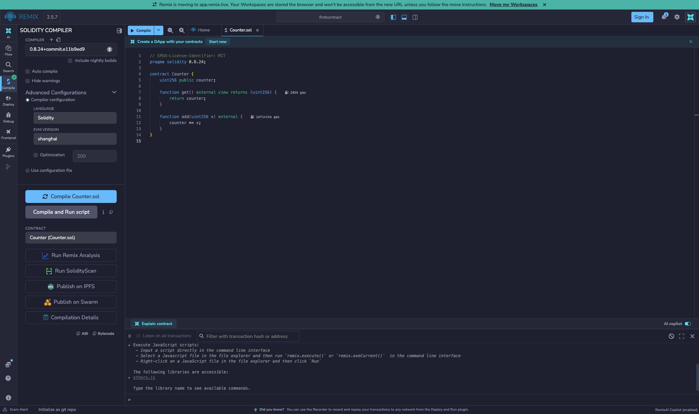
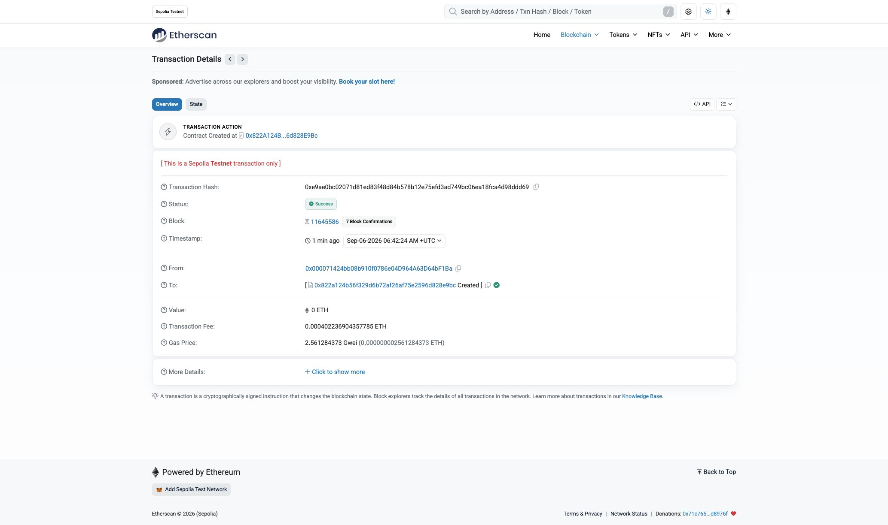
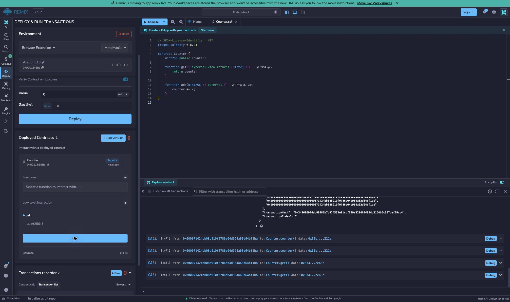
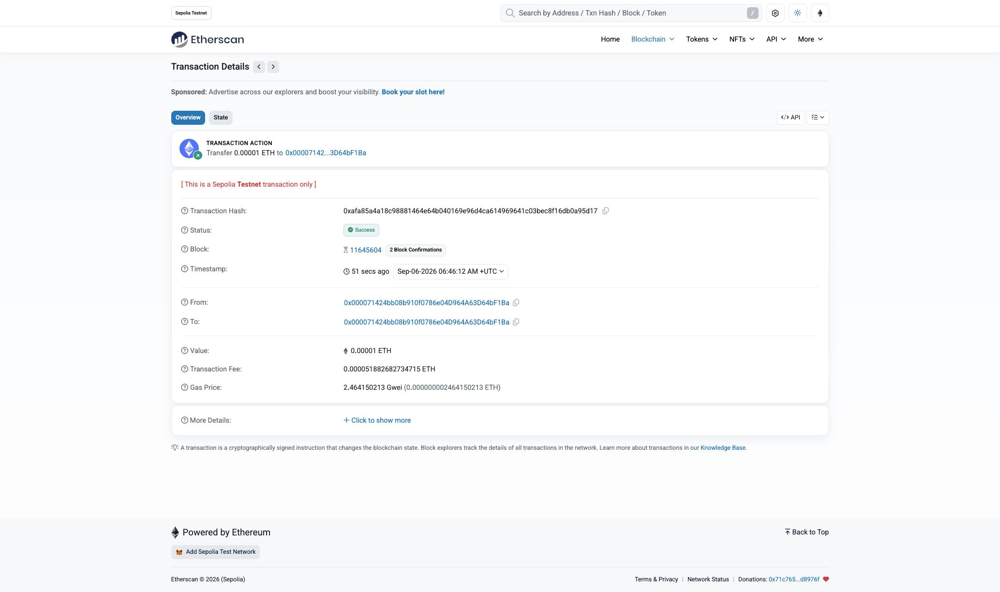

# 04 · 第一个合约：把数字从 0 加到 5

合约可以先理解为“存放在链上的状态和修改规则”。本项目只有一个数字 `counter`：任何人都能读它，也能调用 `add(x)` 增加它。你会学会区分读数据和发交易。

## 用 0 → 5 → 8 理解状态变化

部署完成后 `counter = 0`。调用 `get()` 得到 0；调用 `add(5)` 成功后变成 5；再调用 `add(3)` 变成 8。其他账户读到的是同一个值，不是每个人各有一个计数器。

`get()` 是读取，不改变链上状态；`add` 是写入，需要交易执行成功。提交交易、等待打包、回执成功、再次读取，是四个不同步骤。

## 先跑本地检查

已安装 Foundry 时，在仓库根目录执行：

```bash
forge fmt --root firstcontract-04 --check
forge test --root firstcontract-04 -vv
```

Forge 自带测试 EVM（执行合约的虚拟机），不用启动 Anvil，也不用钱包。测试检查初始值、连续累加、加零、读取接口及溢出回滚。2026-10-09 已通过此项 Forge 测试，并检查源码格式。

## 再在 Remix VM 动手

1. 在 Remix 导入 [Counter.sol](contracts/Counter.sol)。编译器选 `0.8.24`，EVM 目标 `shanghai`，关闭优化，与 [foundry.toml](foundry.toml) 一致。
2. 选 **Remix VM**，Value 保持 `0 Wei`，部署 `Counter`。这里用模拟账户，无需连接真实钱包。
3. 调用 `get()`，预期 0；在 `add` 输入 5 并执行，交易成功后再读，预期 5。
4. 再加 3，预期 8；加 0，仍为 8。一次失败交易不会留下部分加法结果。

界面和课程交付的详细步骤见 [操作指南](USAGE.md)。第一次学习完成 VM 流程即可；Sepolia 是单独的公共测试网步骤。

## 对照源码理解

[Counter.sol](contracts/Counter.sol) 只有三个要点：`uint256 public counter` 保存非负整数，并自动生成 `counter()` 读取接口；`get()` 也读取同一变量；`add(x)` 把旧值加 x 写回。

`uint256` 有上限。超过上限时 Solidity 0.8.24 会回滚，所以不会绕回 0。[Counter.t.sol](test/Counter.t.sol) 用测试验证这个边界。

本项目当前没有 `script/` 部署入口；本地学习使用 Forge 测试或 Remix VM，不提供一条不存在的 `forge script` 命令。编译缓存位于仓库 `output-tdd/firstcontract/`。

下面是历史公共链证据，不代表当前源码已经重新部署，也不代表本次有新的转账或签名授权。

## 历史 Sepolia 记录（2026-09-06）

以下为实际链上记录。钱包签名由本人确认，交易回执已用 Sepolia RPC 独立核对。

```text
网络：Sepolia
Chain ID：11155111
钱包公开地址：0x000071424bb08b910f0786e04D964A63D64bF1Ba
测试币来源：使用钱包已有 Sepolia ETH，该次未向水龙头领取
收款地址：0x000071424bb08b910f0786e04D964A63D64bF1Ba（自转账）
转账金额（Sepolia ETH）：0.00001
转账交易 Hash：0xafa85a4a18c98881464e64b040169e96d4ca614969641c03bec8f16db0a95d17
转账区块：11645604
合约地址：0x822A124B56f329D6B72aF26af75E2596d828E9Bc
部署交易 Hash：0xe9ae0bc02071d81ed83f48d84b578b12e75efd3ad749bc06ea18fca4d98ddd69
部署区块：11645586
add(x) 参数：5
add(x) 交易 Hash：0x243600974db99281b7b824532e81cbf629e328d024944d3150b6c357def29cd4
add(x) 区块：11645594
调用后 get() 结果：5
部署 Gas 费用（Sepolia ETH）：0.000402236904357785
add(5) Gas 费用（Sepolia ETH）：0.000366696110868464
转账 Gas 费用（Sepolia ETH）：0.000051882682734715
合计 Gas 费用（Sepolia ETH）：0.000820815697960964
用户授权 Gas 总上限（Sepolia ETH）：0.001
```

- [转账成功详情](https://sepolia.etherscan.io/tx/0xafa85a4a18c98881464e64b040169e96d4ca614969641c03bec8f16db0a95d17)
- [部署成功详情](https://sepolia.etherscan.io/tx/0xe9ae0bc02071d81ed83f48d84b578b12e75efd3ad749bc06ea18fca4d98ddd69)
- [add(5) 交易链接（答题提交此链接）](https://sepolia.etherscan.io/tx/0x243600974db99281b7b824532e81cbf629e328d024944d3150b6c357def29cd4)
- [Counter 合约地址](https://sepolia.etherscan.io/address/0x822A124B56f329D6B72aF26af75E2596d828E9Bc)
- [已验证源码：Blockscout](https://eth-sepolia.blockscout.com/address/0x822A124B56f329D6B72aF26af75E2596d828E9Bc?tab=contract)
- [已验证源码：Sourcify](https://repo.sourcify.dev/11155111/0x822A124B56f329D6B72aF26af75E2596d828E9Bc/)

该次 `add(5)` 由 MetaMask 以 EIP-7702（type 4）交易执行，顶层交易的 `to` 是 `0xdb9B1e94B5b69Df7e401DDbedE43491141047dB3`。已核对 [Blockscout 内部调用](https://eth-sepolia.blockscout.com/tx/0x243600974db99281b7b824532e81cbf629e328d024944d3150b6c357def29cd4)：它成功调用上面的 Counter；通过 RPC 读取区块 `11645593` 和 `11645594`，`get()` 分别返回 `0` 和 `5`。不要把顶层 `to` 地址误填成作业的 Counter 地址。

源码的链上完整运行字节码与本地 Foundry 编译结果一致。Remix 自动源码验证在 Blockscout、Sourcify 成功；Etherscan 因未配置 API key 跳过，Routescan 查询超时，均不影响已成功的部署。

可在本地复核历史状态：

```bash
cast call 0x822A124B56f329D6B72aF26af75E2596d828E9Bc 'get()(uint256)' --block 11645593 --rpc-url https://ethereum-sepolia-rpc.publicnode.com
cast call 0x822A124B56f329D6B72aF26af75E2596d828E9Bc 'get()(uint256)' --block 11645594 --rpc-url https://ethereum-sepolia-rpc.publicnode.com
```

## 实际截图

编译通过：



Sepolia 部署成功：



`add(5)` 后在 Remix 读取 `get()` 为 `5`：



向自身转账 `0.00001` Sepolia ETH 成功：



本目录使用现有仓库下的 [firstcontract 文件夹](https://github.com/woyaofei303/block-chain-list/tree/main/firstcontract-04)，不另建嵌套 Git 仓库。登链答题框填写上面的 `add(5)` 交易链接；该次未代为提交登链答题表单。
