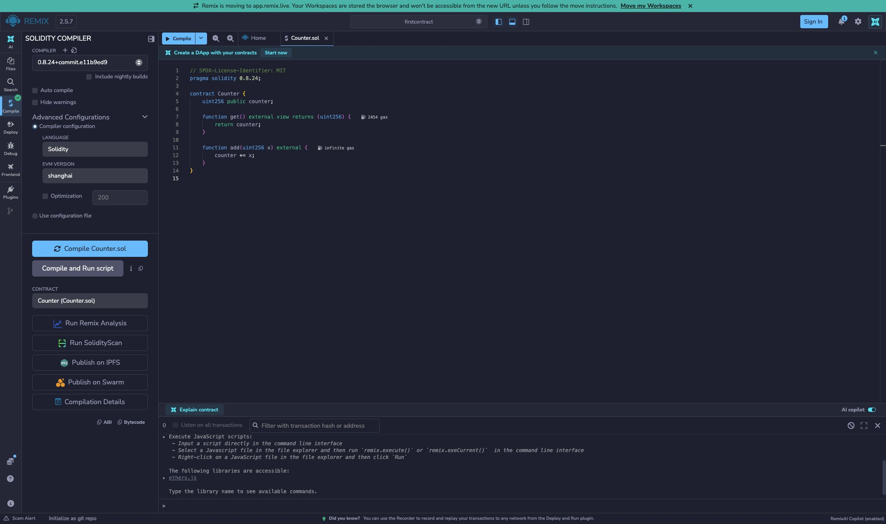
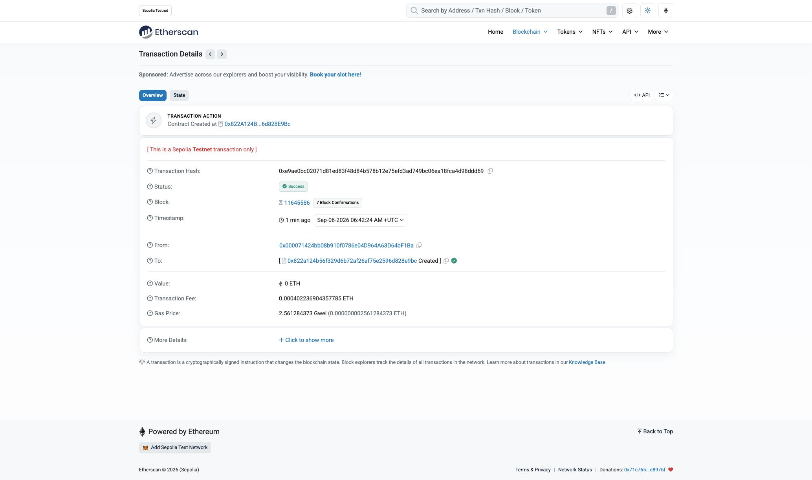
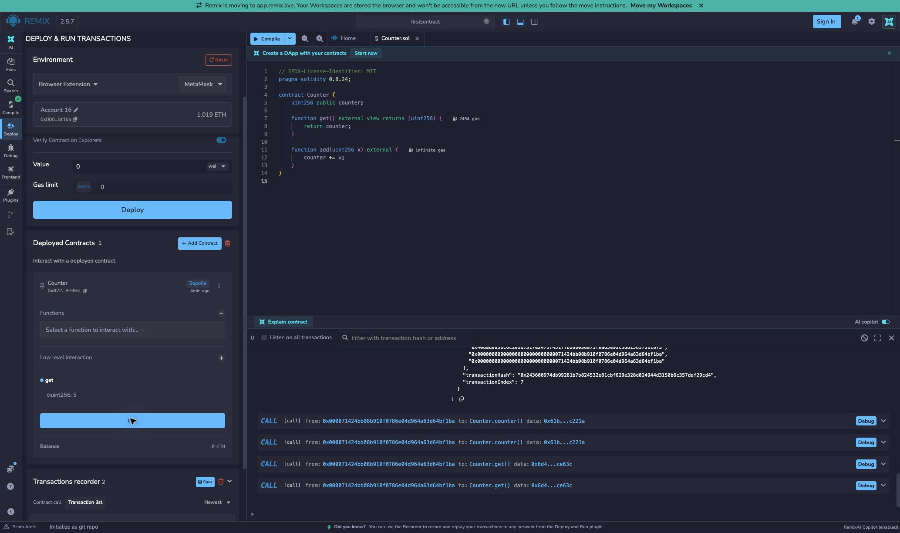
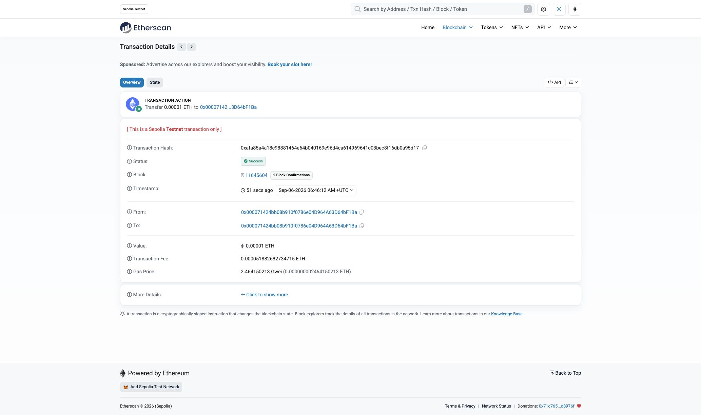

# First Contract：Counter

对应截图练习：准备测试钱包和测试币、转账一次、用 Remix 部署 Counter 到 Sepolia，并提交代码、截图和交易 Hash。

完整操作步骤见 [Counter 操作指南](USAGE.md)，包含 Foundry 安装、Forge 编译测试、Anvil 本地链、Cast 调用、钱包与测试币、Remix 部署以及 GitHub 和课程答案提交。

2026-09-06 已使用现有 MetaMask 和已有测试币完成自转账、Remix 部署及 `add(5)`。三笔交易回执均成功，`get()` 从 `0` 变为 `5`。本次没有新建钱包或重复向水龙头领币。

[课程题目](https://learnblockchain.cn/quest/ffadfacf-91cf-4f69-bea3-12226bb8ecca/challenging)要求 `counter` 状态变量、`get()` 和 `add(x)`，答题框提交 **调用 `add(x)` 的交易浏览器链接**。

## 合约与本地验证

- `contracts/Counter.sol`：初始值为 0，任何账户都可以调用 `add(uint256 x)` 累加；`get()` 和自动生成的 `counter()` 均可读取当前值。
- `add(0)` 保持原值；超过 `uint256` 上限时由 Solidity 回退，状态不变。
- `test/Counter.t.sol`：一项可运行检查覆盖初始值、连续累加、加零、两个读取接口及溢出回退。
- `foundry.toml`：Solidity `0.8.24`、EVM `shanghai`、不启用优化，不依赖第三方合约库。

在本仓库根目录执行，需已安装 [Foundry](https://getfoundry.sh/introduction/installation/)：

```bash
forge fmt --root firstcontract --check
forge test --root firstcontract -vv
```

编译产物和缓存写入仓库的 `output-tdd/firstcontract/`，不属于提交材料。

## 钱包、测试币与转账

1. 使用现有 MetaMask，或通过现有 AppKit 页面选择兼容 EVM 的钱包；确认网络为 **Sepolia（chain ID 11155111）**。钱包创建、解锁及助记词备份由本人完成。
2. 如需领币，从 [Ethereum 官方测试网与水龙头列表](https://ethereum.org/developers/docs/networks/#sepolia)选择水龙头，仅填写公开地址并按站点要求领取 Sepolia ETH。
3. 向本人控制的地址转出一笔小额测试币，例如 `0.00001` Sepolia ETH；本次按用户授权向自身转账。签名前核对发送账户、收款地址、金额和 Gas；记录成功回执的交易 Hash。
4. 若已有测试币和已完成的转账，可记录并核验已有证据，无需为截图重复领币或转账。

不要在此目录、GitHub、README 或截图中保存私钥、助记词和钱包密码。

## 使用 Remix 部署与调用

1. 打开 [Remix](https://remix.ethereum.org/)，使用独立工作区 `firstcontract`，创建 `contracts/Counter.sol` 并复制本目录同名文件内容。
2. 在 Solidity Compiler 中选择 `0.8.24+commit.e11b9ed9`，EVM Version 为 `shanghai`，Optimization 不勾选，编译 `Counter.sol`。
3. 在 Deploy & Run 中连接浏览器钱包或 WalletConnect，核对钱包与 Remix 都显示 Sepolia。选择 `Counter`，Value 为 `0 Wei`，点击 Deploy 并在钱包中确认部署交易。
4. 等待部署成功，记录合约地址和部署交易 Hash。展开合约，调用 `get()`，初始值应为 `0`。
5. 在 `add` 参数中输入 `5`，发送并确认交易；回执成功后再次调用 `get()`，值应为 `5`。记录 **这笔 add(5) 交易** 的 Hash。
6. 截图应包括 Remix 编译结果、Sepolia 转账成功详情、部署成功详情，以及 `add(5)` 成功后读取的数值。Remix VM 本地模拟只能作为预演，不是 Sepolia 部署证据。

连接与部署操作见 [Remix 官方说明](https://remix-ide.readthedocs.io/en/latest/run.html)；溢出行为见 [Solidity 0.8.24 官方说明](https://docs.soliditylang.org/en/v0.8.24/control-structures.html#checked-or-unchecked-arithmetic)。

## 提交记录

以下为实际链上记录。钱包签名由本人确认，交易回执已用 Sepolia RPC 独立核对。

```text
网络：Sepolia
Chain ID：11155111
钱包公开地址：0x000071424bb08b910f0786e04D964A63D64bF1Ba
测试币来源：使用钱包已有 Sepolia ETH，本次未向水龙头领取
收款地址：0x000071424bb08b910f0786e04D964A63D64bF1Ba（自转账）
转账金额（Sepolia ETH）：0.00001
转账交易 Hash：0xafa85a4a18c98881464e64b040169e96d4ca614969641c03bec8f16db0a95d17
转账区块：11645604
合约地址：0x822A124B56f329D6B72aF26af75E2596d828E9Bc
部署交易 Hash：0xe9ae0bc02071d81ed83f48d84b578b12e75efd3ad749bc06ea18fca4d98ddd69
部署区块：11645586
add(x) 参数：5
add(x) 交易 Hash：0x243600974db99281b7b824532e81cbf629e328d024944d3150b6c357def29cd4
add(x) 区块：11645594
调用后 get() 结果：5
部署 Gas 费用（Sepolia ETH）：0.000402236904357785
add(5) Gas 费用（Sepolia ETH）：0.000366696110868464
转账 Gas 费用（Sepolia ETH）：0.000051882682734715
合计 Gas 费用（Sepolia ETH）：0.000820815697960964
用户授权 Gas 总上限（Sepolia ETH）：0.001
```

- [转账成功详情](https://sepolia.etherscan.io/tx/0xafa85a4a18c98881464e64b040169e96d4ca614969641c03bec8f16db0a95d17)
- [部署成功详情](https://sepolia.etherscan.io/tx/0xe9ae0bc02071d81ed83f48d84b578b12e75efd3ad749bc06ea18fca4d98ddd69)
- [add(5) 交易链接（答题提交此链接）](https://sepolia.etherscan.io/tx/0x243600974db99281b7b824532e81cbf629e328d024944d3150b6c357def29cd4)
- [Counter 合约地址](https://sepolia.etherscan.io/address/0x822A124B56f329D6B72aF26af75E2596d828E9Bc)
- [已验证源码：Blockscout](https://eth-sepolia.blockscout.com/address/0x822A124B56f329D6B72aF26af75E2596d828E9Bc?tab=contract)
- [已验证源码：Sourcify](https://repo.sourcify.dev/11155111/0x822A124B56f329D6B72aF26af75E2596d828E9Bc/)

本次 `add(5)` 由 MetaMask 以 EIP-7702（type 4）交易执行，顶层交易的 `to` 是 `0xdb9B1e94B5b69Df7e401DDbedE43491141047dB3`。已核对 [Blockscout 内部调用](https://eth-sepolia.blockscout.com/tx/0x243600974db99281b7b824532e81cbf629e328d024944d3150b6c357def29cd4)：它成功调用上面的 Counter；通过 RPC 读取区块 `11645593` 和 `11645594`，`get()` 分别返回 `0` 和 `5`。不要把顶层 `to` 地址误填成作业的 Counter 地址。

源码的链上完整运行字节码与本地 Foundry 编译结果一致。Remix 自动源码验证在 Blockscout、Sourcify 成功；Etherscan 因未配置 API key 跳过，Routescan 查询超时，均不影响已成功的部署。

可在本地复核历史状态：

```bash
cast call 0x822A124B56f329D6B72aF26af75E2596d828E9Bc 'get()(uint256)' --block 11645593 --rpc-url https://ethereum-sepolia-rpc.publicnode.com
cast call 0x822A124B56f329D6B72aF26af75E2596d828E9Bc 'get()(uint256)' --block 11645594 --rpc-url https://ethereum-sepolia-rpc.publicnode.com
```

## 实际截图

编译通过：



Sepolia 部署成功：



`add(5)` 后在 Remix 读取 `get()` 为 `5`：



向自身转账 `0.00001` Sepolia ETH 成功：



本目录使用现有仓库下的 [firstcontract 文件夹](https://github.com/woyaofei303/block-chain-list/tree/main/firstcontract)，不另建嵌套 Git 仓库。登链答题框填写上面的 `add(5)` 交易链接；本次未代为提交登链答题表单。
