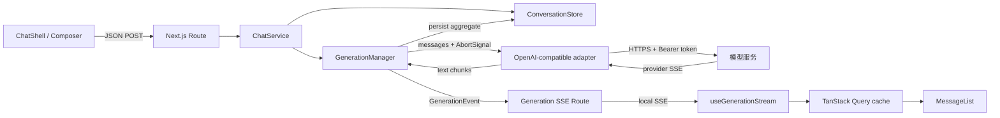
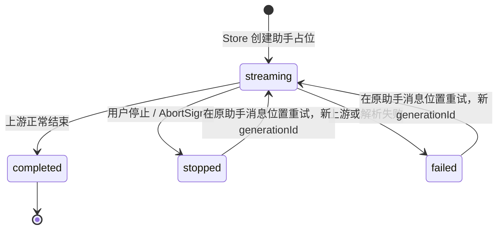

# Multi Chat 架构与代码阅读链路

这份文档描述当前代码已经实现的真实链路，不是未来设计。主线以 Web 版为准；
`multi_chat.py` 是独立终端版，只与 Web 版发生一次性的历史导入关系。

## 一句话全景

浏览器先通过 JSON `POST` 持久化一轮对话并取得 `generationId`，Next.js 服务端再在
后台请求 OpenAI Chat Completions 兼容接口；模型的 SSE 被解析成文本增量，进入本机
生成事件缓冲区，再由另一个 SSE `GET` 转发到浏览器，最终合并进 TanStack Query
缓存并由 React 渲染。



## 推荐阅读顺序

第一次阅读按下面顺序走，不要从所有 `route.ts` 横向展开。

1. `README.md`
   - 先了解运行方式、环境变量和 Web/终端版关系。
2. `web/app/page.tsx`
   - Web 页面入口，只挂载 `ChatShell`。
3. `web/features/chat/client/chat-shell.tsx`
   - 客户端组合入口：选择会话、发送、重试、停止，以及 UI 组装。
4. `web/features/chat/client/use-send-message.ts`
   - “发送/重试”怎样发起 HTTP Mutation，以及成功后怎样刷新会话缓存。
5. `web/features/chat/contracts.ts`
   - 一次发送/重试跨越浏览器、Route、ChatService 时共用的数据契约。
6. `web/app/api/conversations/[id]/messages/route.ts`
   - 发送消息 HTTP 边界：读取未知 JSON、校验、转换成命令。
7. `web/server/runtime.ts`
   - 服务端组合根：Store、GenerationManager、模型适配器和 ChatService 在这里接线。
8. `web/features/chat/server/service.ts`
   - 跨领域用例：先写会话，再取模型上下文，最后启动生成任务。
9. `web/domains/conversation/server/store.ts`
   - 会话/消息如何落盘，请求如何幂等，哪些消息会进入下一轮上下文。
10. `web/domains/generation/server/manager.ts`
    - 生成状态机：启动、缓存事件、聚合正文、持久化、停止和失败。
11. `web/domains/generation/server/openai-compatible.ts`
    - 怎样连接模型、发送请求，以及怎样把供应商 SSE 解析成文本增量。
12. `web/app/api/generations/[id]/route.ts`
    - 怎样把本机生成事件序列化为浏览器可订阅的 SSE。
13. `web/features/chat/client/use-generation-stream.ts`
    - 浏览器怎样订阅、重连和把事件写入 Query 缓存。
14. `web/features/chat/client/apply-generation-event.ts`
    - 单个 SSE 事件怎样变成新的助手消息状态。
15. `web/domains/conversation/ui/message-list.tsx`
    - 最终怎样把消息正文渲染为 Markdown，并阻止原始 HTML 执行。

理解主链后再读这些支线：

- 会话列表/新建：`web/app/api/conversations/route.ts`
- 会话详情/改名/删除：`web/app/api/conversations/[id]/route.ts`
- 浏览器 JSON 错误处理：`web/shared/http-client.ts`
- Route 输入与错误映射：`web/shared/http-server.ts`
- 统一退避算法：`web/shared/retry.ts`
- 行为验证：`web/tests/*.test.mts`
- 终端版：`multi_chat.py` -> `test_multi_chat.py`

## 目录边界

`web/app`

- Next.js 的页面与 HTTP/SSE 适配器。
- Route 负责协议、输入校验和 HTTP 状态码，不实现聊天流程。

`web/features/chat`

- 完整聊天用例的编排层。
- `contracts.ts` 是用例契约；`client` 编排浏览器行为；`server` 连接两个领域。

`web/domains/conversation`

- 会话、消息、标题、历史、上下文和持久化。
- 不知道模型供应商协议，也不知道 SSE。

`web/domains/generation`

- 一次模型生成的事件、生命周期、取消和 OpenAI 兼容接入。
- 不知道页面组件，也不直接管理会话列表。

`web/server`

- 只做依赖组装。API Key 在这条服务端模块图中使用，不进入客户端模块图。

`web/shared`

- 无聊天业务语义的 HTTP 和重试工具。

领域串接只有一个正式入口：`createChatService()`。Conversation 先产生稳定的
`generationId` 和模型上下文，Generation 再消费它；Generation 产生聚合更新后，
通过 `persist` 回调写回 Conversation。两个领域因此不直接互相 import。

## 一次发送的完整闭环

### 1. 浏览器发起命令

`ChatShell.handleSend()` 和 `useSendMessage()` 会：

1. 没有活动会话时先调用 `POST /api/conversations`。
2. 生成一个 `crypto.randomUUID()` 作为 `requestKey`。
3. 调用 `sendMessage.mutateAsync()`，由 Hook 组装下面的 HTTP 请求。

新消息的 HTTP 请求为：

```http
POST /api/conversations/<conversationId>/messages
Content-Type: application/json
```

```json
{
  "content": "用户问题",
  "requestKey": "browser-generated-uuid"
}
```

重试失败或停止的回答时，请求改为：

```json
{
  "retryAssistantMessageId": "assistant-message-id",
  "requestKey": "new-browser-generated-uuid"
}
```

`conversationId` 只在 URL 中，不重复放入请求体。两种请求共享
`features/chat/contracts.ts` 中的 `SendMessageCommand`。

### 2. Route 校验外部输入

`messages/route.ts` 把 HTTP JSON 当作不可信数据处理：

- `requestKey` 必须是 1 到 128 字符的安全标识符。
- 普通消息去除首尾空白后不能为空，最长 32000 字符。
- 重试消息 ID 使用同一标识符规则。
- 输入转换成 `SendMessageCommand` 后才交给 `ChatService`。

成功响应只确认任务已经建立：

```json
{
  "reused": false,
  "generationId": "generation-id",
  "assistantMessageId": "assistant-message-id"
}
```

这不是模型答案。模型答案走后面的 SSE 通道。

### 3. ChatService 连接两个领域

`ChatService.sendMessage()` 的顺序不能交换：

1. 读取当前模型名。
2. 调用 `ConversationStore.addUserTurn()`；重试则调用 `retryAssistant()`。
3. Store 在一次串行写操作中保存用户消息和空的助手占位消息。
4. Store 返回 `generationId`。
5. ChatService 用该 ID 获取上下文。
6. ChatService 调用 `GenerationManager.start()`，但不等待整段回答完成。
7. Route 立即把任务 ID 返回浏览器。

同一个 `requestKey` 被 HTTP 层重试时，Store 返回原来的 `generationId` 和
`reused: true`。ChatService 此时不会再次调用模型，避免重复计费和两份回答。

### 4. Store 组装模型上下文

`getGenerationContext()` 找到本轮助手占位消息，只取它之前的消息：

- 所有用户消息进入上下文。
- 只有 `completed` 的助手消息进入上下文。
- 当前空占位、失败回答和主动停止的残缺回答不会发给模型。

发给生成领域的数据被压缩为：

```ts
type ModelMessage = {
  role: "user" | "assistant"
  content: string
}
```

### 5. 服务端连接大模型

`runtime.ts` 把 `GenerationManager.stream` 接到 `streamChatCompletion()`。
后者从仅服务端可见的环境变量读取配置，并请求：

```http
POST <AI_BASE_URL>/chat/completions
Authorization: Bearer <AI_API_KEY>
Content-Type: application/json
```

```json
{
  "model": "<AI_MODEL>",
  "messages": [
    { "role": "user", "content": "用户问题" }
  ],
  "stream": true
}
```

单次上游请求最多等待 300 秒。仅在还没有收到任何 token 时，临时网络错误、超时、
`408/425/429/5xx` 才会退避重试；一旦已经收到 token 就不自动重试，因为把两次
不同回答拼接在一起会损坏内容。

### 6. 解析大模型返回

供应商返回的是 OpenAI 兼容 SSE，例如：

```text
data: {"choices":[{"delta":{"content":"你"}}]}

data: {"choices":[{"delta":{"content":"好"}}]}

data: [DONE]

```

`parseOpenAiStream()` 分四步处理：

1. `ReadableStream` 的网络块先经过 `TextDecoder`。
2. 网络块不等于 SSE 事件，因此先累积到 `buffer`，再按空行切事件。
3. 合并事件内的所有 `data:` 行并解析 JSON。
4. 只产出 `choices[0].delta.content` 中的非空字符串，忽略 `[DONE]` 和无正文事件。

若兼容服务正常关闭连接但最后一个事件没有尾部空行，解析器也会处理缓冲区中的
最后一个完整事件。对应行为由 `web/tests/ai.test.mts` 覆盖。

### 7. GenerationManager 同时输出实时事件和持久化快照

每收到一个文本增量，`GenerationManager` 会：

1. 把文本追加到当前完整 `content`。
2. 发布单调递增 ID 的 `delta` 事件。
3. 合并高频磁盘写，约每 250ms 持久化一次 `streaming` 快照。

模型流正常结束时，Manager 先持久化 `completed` 完整正文，再发布 `done`。顺序是
刻意的：浏览器收到 `done` 后立即重新获取详情，必须已经能读到权威终态。



### 8. 本机 SSE 把事件喂给前台

浏览器发现详情中有 `status: "streaming"` 且带 `generationId` 的消息后，
`useGenerationStream()` 创建：

```text
GET /api/generations/<generationId>?after=<lastEventId>
```

该 Route 不访问供应商。它订阅 `GenerationManager` 的内存缓冲，并发送本机事件：

```text
id: 1
event: delta
data: {"text":"你"}

id: 2
event: done
data: {}

```

Route 先订阅实时事件再回放历史，避免“读完历史、尚未订阅”之间漏 token。极小窗口
可能重复发送，因此客户端使用单调 `event.id` 去重。

### 9. 浏览器解析并渲染

`useGenerationStream()` 为 `delta/done/stopped/error` 分别注册监听器：

1. 从 `MessageEvent.lastEventId` 读取事件 ID。
2. 对 `event.data` 执行 `JSON.parse()`。
3. 在 Query 缓存中找到相同 `generationId` 的助手消息。
4. 用纯函数 `applyGenerationEvent()` 追加文本或切换终态。
5. React 因缓存变更重新渲染 `MessageList`。

`MessageList` 使用 `react-markdown` 与 GFM 渲染正文，但没有启用 `rehype-raw`，所以
模型输出里的原始 HTML 不会作为可执行 DOM 注入页面。

收到终态后，客户端先关闭 EventSource，再刷新会话详情和列表：屏幕上的即时内容
来自 SSE，刷新后的权威内容来自 Store。

## 断线、停止、失败与重试

### 浏览器断线

- Query 缓存中的 `lastEventId` 是浏览器已应用进度。
- 重连 URL 的 `after` 带回该进度。
- 服务端只回放更大的事件 ID。
- 客户端仍再次按 ID 去重。
- 最多自动重连 5 次，使用 Full Jitter 指数退避。
- 完成任务的事件缓冲保留 10 分钟，供刚断线的页面续传。

### 用户停止

`ChatShell` 调用 `DELETE /api/generations/:id`，Route 触发 `AbortController.abort()`；
Manager 保留已经生成的正文、持久化 `stopped`，再发出 `stopped` 事件。

### 上游失败

Manager 保留部分正文、持久化 `failed`，再发出带通用提示的 `error` 事件。具体供应商
异常不会进入浏览器错误响应，避免暴露内部响应、路径或密钥相关信息。

### 回答重试

重试复用原助手消息的位置，清空残缺内容，并换成新的 `generationId` 和
`requestKey`。这样历史中不会额外插入一条同义助手回答。

## 存储闭环

Web 数据默认位于 `web/data/chat-store.json`：

- 同一 Node.js 进程只加载一次，后续共享内存快照。
- 所有写操作串行进入一个 Promise 链，避免本进程内互相覆盖。
- 每次先写 `.tmp`，再原子替换正式 JSON。
- 进程重启后无法恢复旧的内存模型流，遗留 `streaming` 消息会变为 `failed`。
- Web 存储首次不存在时，才从根目录 `chat_history.json` 导入终端历史一次。

当前实现明确面向本机单进程。多实例部署时，JSON 文件和内存事件缓冲都不够用；
届时应把 Store 换成事务数据库，把生成任务/事件换成共享队列或 Pub/Sub。现在不为
尚不存在的部署形态增加抽象层。

## HTTP 接口索引

- `GET /api/conversations`
  - 返回模型显示名和按更新时间倒序的会话摘要。
- `POST /api/conversations`
  - 创建空会话。
- `GET /api/conversations/:id`
  - 返回完整会话和消息。
- `PATCH /api/conversations/:id`
  - 修改标题。
- `DELETE /api/conversations/:id`
  - 先停止并等待该会话的活动生成，再删除会话。
- `POST /api/conversations/:id/messages`
  - 创建新一轮或重试一条助手消息，返回生成任务 ID。
- `GET /api/generations/:id?after=N`
  - 订阅/回放本机生成 SSE。
- `DELETE /api/generations/:id`
  - 请求停止生成，成功返回 `202`。

## 必须保持的关键不变量

1. API Key 只能在服务端 `openai-compatible.ts` 所在模块图中读取。
2. Route 先验证未知输入，再调用用例或领域方法。
3. 用户消息和助手占位必须先持久化，之后才能启动模型任务。
4. 同一会话内的同一个 `requestKey` 只能对应一次模型调用。
5. 收到第一个 token 后，上游请求不得自动重试并拼接另一份回答。
6. 终态必须先持久化，再向浏览器发布终态事件。
7. SSE 重放依赖单调事件 ID，客户端必须去重。
8. 删除会话前必须停止并等待其活动任务，否则后台任务会写回已删除会话。
9. 失败/停止的助手残缺内容不得进入下一轮模型上下文。
10. 一个会话同时最多只能有一个 `streaming` 助手消息。

## 修改和排查入口

- 修改模型地址、Key 或模型名
  - 先看 `.env.example`，再看 `openai-compatible.ts` 的 `getAiConfig()`。
- 接入另一个 OpenAI Chat Completions 兼容服务
  - 通常只改环境变量，不改业务代码。
- 接入非兼容协议
  - 替换/新增服务端适配函数，保持输出为 `AsyncIterable<string>`，Manager 以上不动。
- 消息发不出去
  - 依次看 `ChatShell.handleSend()`、`use-send-message.ts`、消息 POST Route 和 HTTP 状态码。
- 服务端收到消息但模型没有回答
  - 看 `runtime.ts` 接线、模型配置、`streamChatCompletion()` 的上游响应状态。
- 模型有输出但页面没有 token
  - 看 Manager 是否发布 `delta`、SSE Route 是否响应、Hook 的 EventSource 连接。
- 页面出现重复文本
  - 核对服务端事件 ID、缓存中的 `lastEventId` 和 `applyGenerationEvent()` 去重。
- 重启后生成变成失败
  - 这是本机内存任务无法跨进程恢复的预期行为。
- 修改持久化规则
  - 集中改 `ConversationStore`，不要在 Route 或组件里直接操作 JSON 文件。

## 测试与链路对应

- `ai.test.mts`：供应商 SSE 分块和尾事件解析。
- `chat-service.test.mts`：重复请求不会重复调用模型。
- `client-events.test.mts`：客户端事件重放去重。
- `generations.test.mts`：事件回放、终态、失败和停止。
- `store.test.mts`：导入、幂等、重试和重启恢复。
- `retry.test.mts`：重试状态和退避上限。
- `test_multi_chat.py`：终端版历史读写与多轮上下文。

## 终端版链路

终端版不经过 Next.js，也没有 SSE：

```text
main()
  -> load_history(chat_history.json)
  -> OpenAI(api_key, base_url)
  -> complete_turn(client, model, history, prompt)
  -> client.chat.completions.create(..., stream=false)
  -> response.choices[0].message.content
  -> save_history(chat_history.json)
```

只有请求成功后才把本轮用户消息和助手回答加入历史。Web 首次创建自己的 Store 时可
导入这份历史，之后两端分别维护各自的数据。
