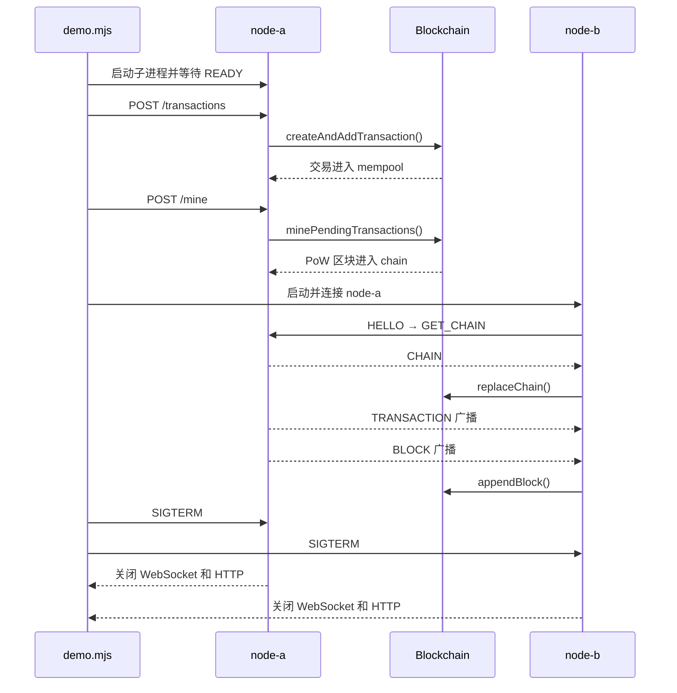

# Node.js 区块链教学作业

这个项目用最小可运行节点覆盖三件事：SHA-256 + nonce 的 PoW、交易入块，以及两个独立节点间的交易/区块广播与落后节点同步。运行环境为 Node.js 20+、ESM，除 WebSocket 的 `ws` 外只使用标准库。

## 架构

HTTP 是用户操作面：提交交易、挖矿、查看状态；WebSocket (`/p2p`) 是节点间的持续连接。节点连接后发送 `HELLO`；链头不同时发送 `GET_CHAIN` 并接收完整 `CHAIN`。新交易和新区块分别以 `TRANSACTION`、`BLOCK` 广播，按 ID/哈希去重。

- `src/blockchain.mjs`：交易、区块哈希、PoW 和链验证。
- `src/node.mjs`：HTTP API、P2P 协议，以及可直接运行的 CLI。
- `demo.mjs`：启动两个真实子进程，验证晚加入同步和实时广播。

## 从入口到结束的完整流程

建议第一次阅读时先执行 `npm run demo`，再按下面的编号在源码中搜索“全流程”。这些注释把 `demo.mjs`、`src/node.mjs` 和 `src/blockchain.mjs` 串成同一条调用链。



### 1. 自动演示入口

`npm run demo` 执行 `node demo.mjs`。文件末尾的直接运行判断调用 `runDemo()`；如果该文件只是被测试导入，则不会自动运行。`runDemo()` 先申请两个临时端口，然后启动 node-a 子进程。

```text
package.json: demo
  → demo.mjs: 直接运行判断
  → runDemo()
  → unusedPort()
  → startNode(node-a)
```

### 2. 节点启动并对外服务

`startNode()` 实际执行 `node src/node.mjs ...`。`src/node.mjs` 的 CLI 入口解析参数并调用 `createNode()`；`node.start()` 开启共用同一端口的 HTTP 服务和 `/p2p` WebSocket 服务，最后输出 `READY`。演示必须等到 `READY` 后才继续请求，避免请求早于监听。

```text
spawn(src/node.mjs)
  → parseArgs()
  → validatePeerUrls()
  → createNode()
  → node.start()
  → server.listen()
  → createWebSocketServer()
  → READY
```

### 3. 交易进入待打包池

演示向 node-a 发送 `POST /transactions`。HTTP 层读取并限制 JSON 请求体；共识层规范化发送方、接收方和金额，用 SHA-256 生成交易 ID，再通过 `addTransaction()` 校验和去重。成功后交易进入 `mempool`，节点同时向已连接邻居广播 `TRANSACTION`。

```text
POST /transactions
  → readJson()
  → state.createAndAddTransaction()
  → createTransaction()
  → sha256Hex()
  → state.addTransaction()
  → mempool.push()
  → broadcast("TRANSACTION")
```

### 4. PoW 挖矿并打包交易

演示发送 `POST /mine`。`minePendingTransactions()` 把当前 `mempool` 交给 `mineBlock()`；后者从 `nonce = 0` 开始反复计算区块 SHA-256，直到哈希满足指定数量的前导零。新区块加入本地 `chain`，已打包交易从 `mempool` 移除，并广播 `BLOCK`。HTTP 响应和日志都会打印本次挖矿耗时。

```text
POST /mine
  → state.minePendingTransactions()
  → mineBlock()
  → calculateBlockHash()
  → nonce += 1，直到满足难度
  → chain.push(block)
  → 清理 mempool
  → broadcast("BLOCK")
```

### 5. 晚加入节点同步已有区块

node-a 已经挖出区块后，演示才启动 node-b，并通过 `--peer` 连接 node-a。连接建立时双方发送 `HELLO`；链头不同的一方发送 `GET_CHAIN`，对方返回完整 `CHAIN`。node-b 使用 `replaceChain()` 验证创世块、所有交易、前后哈希、PoW 和累计工作量，只采用累计工作量更大的有效链。

```text
node-b connect(node-a)
  → attachSocket()
  → HELLO
  → GET_CHAIN
  → CHAIN
  → state.replaceChain()
  → isValidChain()
  → chainWork()
```

### 6. 实时交易和新区块广播

链同步完成后，演示再次向 node-a 提交交易。node-b 经 `TRANSACTION` 消息把交易加入自己的 `mempool`。随后 node-a 挖出新区块并广播 `BLOCK`；node-b 调用 `appendBlock()` 验证新区块，通过后追加到本地链并继续向其他邻居转发。演示轮询两个节点的 `tipHash`，相同即表示本轮同步完成。

### 7. 从正常结束到资源释放

无论演示成功还是中途报错，`runDemo()` 的 `finally` 都会向两个子进程发送 `SIGTERM`。节点的 `shutdown()` 调用 `node.stop()`，依次终止待连接和已连接的 socket、关闭 WebSocket 服务、关闭 HTTP 服务并清空公开地址；子进程退出后，演示才真正结束。

```text
runDemo() finally
  → stopChild()
  → SIGTERM
  → shutdown()
  → node.stop()
  → socket.terminate()
  → webSocketServer.close()
  → server.close()
  → 子进程退出
```

### 阅读时建议观察的状态

- `state.mempool`：交易从进入、广播到被区块打包的变化。
- `state.chain` 与 `state.tip`：新区块追加以及完整链替换的结果。
- `candidate.nonce` 与 `candidate.hash`：PoW 循环每次尝试的内容。
- `sockets`、`pendingSockets`：P2P 连接建立和关闭的生命周期。
- `message.type`：`HELLO`、`GET_CHAIN`、`CHAIN`、`TRANSACTION`、`BLOCK` 如何驱动同步。

## 数据字段

交易为 `{ id, from, to, amount, timestamp }`：`from`/`to` 是非空字符串，`amount` 为正的有限数字；`id` 是规范化交易内容的 SHA-256，用于去重。

区块为 `{ index, timestamp, transactions, previousHash, difficulty, nonce, hash }`：`hash` 覆盖其余全部字段，`previousHash` 连接上一区块，`nonce` 递增到哈希满足 `difficulty` 个十六进制前导零。默认难度是 4；每个节点启动后使用固定难度，不做动态难度调整，也不收取交易手续费。

## 安装、测试与自动演示

```bash
npm install
npm test
npm run demo
```

CLI 支持 `--name`、`--port`、`--difficulty` 与可重复的 `--peer`。启动成功后会在 stdout 打印 `READY`；挖矿、验块和同步耗时打印到 stderr，便于脚本稳定读取 READY。

程序化调用 `createNode()` 时，每次 `start()` 或 `stop()` 都必须按顺序 `await` 完成，不要并发重叠生命周期操作。

## 三终端手动演练

终端 1（安装、测试或自动演示）：

```bash
npm install
npm test
npm run demo
```

终端 2（先启动 node-a）：

```bash
node src/node.mjs --name node-a --port 3001 --difficulty 4
```

终端 3（再启动 node-b，并连接 node-a）：

```bash
node src/node.mjs --name node-b --port 3002 --difficulty 4 --peer ws://127.0.0.1:3001/p2p
```

回到终端 1 提交交易、挖矿并查看 node-b：

```bash
curl -s -X POST http://127.0.0.1:3001/transactions \
  -H 'content-type: application/json' \
  -d '{"from":"alice","to":"bob","amount":10}'

curl -s -X POST http://127.0.0.1:3001/mine

curl -s http://127.0.0.1:3002/status
curl -s http://127.0.0.1:3002/chain
```

按 `Ctrl+C` 会优雅停止节点。

## 断点调试

`--inspect-brk` 会在执行第一行前暂停。打开 Chrome DevTools 的 Node 目标，或在 VS Code 使用 “Attach to Node Process” 即可继续并设断点：

```bash
node --inspect-brk src/node.mjs --name node-a --port 3001 --difficulty 2
```

建议按完整流程依次在 `runDemo()`、CLI 入口、HTTP `/transactions`、HTTP `/mine`、`mineBlock()` 的 nonce 循环、`handleMessage()` 和 `stop()` 处设断点。

## 有意保留的教学简化

- 所有数据只在内存中；重启从确定性创世块开始。
- 没有钱包、私钥、签名、余额、UTXO、Gas、合约、手续费、奖励或经济机制。
- 每个节点的难度在启动时固定，没有动态难度调整。
- PoW 在主线程同步运行；难度较低，适合观察，但会短暂阻塞节点。
- 同步直接传整条链，没有区块头、分批下载、Merkle Tree 或二进制编码。
- 没有节点发现、NAT 穿透、数据库和生产级抗攻击保护。

这些取舍让 PoW、交易入块和链替换三条主线可以直接阅读；真实网络需要补齐以上能力。

## 实际运行结果

以下是一次未改动的成功 `npm run demo` 输出（端口和毫秒数每次运行会变化）：

```text
npm warn Unknown user config "sass_binary_site". This will stop working in the next major version of npm.

> node-blockchain-homework@1.0.0 demo
> node demo.mjs

[node-a] HTTP 节点 node-a 已启动：http://127.0.0.1:60539
[node-a] [node-a] READY http://127.0.0.1:60539 p2p=ws://127.0.0.1:60539/p2p
[node-a] 挖矿耗时=1.270 ms
交易1已打包: block=1, tx=1
挖矿耗时: block=1, 1.270 ms
[node-b] HTTP 节点 node-b 已启动：http://127.0.0.1:60540
[node-b] [node-b] READY http://127.0.0.1:60540 p2p=ws://127.0.0.1:60540/p2p
[node-a] 链同步=false, 耗时=0.086 ms
[node-b] 链同步=true, 耗时=0.279 ms
落后节点同步成功: node-a高度=1, node-b高度=1
交易广播成功: node-b待处理交易=1
[node-a] 挖矿耗时=0.421 ms
挖矿耗时: block=2, 0.421 ms
[node-b] 验块=true, 耗时=0.131 ms
新区块广播成功: node-a高度=2, node-b高度=2
两个节点链头一致: true
```
