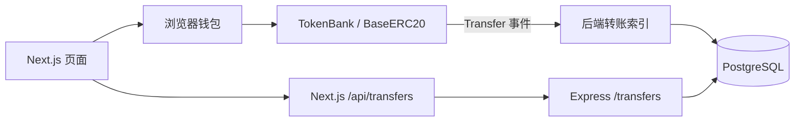

# Token Bank：独立全栈练习

从代币与银行合约，到钱包存取款、PostgreSQL 转账索引、REST API 和页面展示，完整流程都在本项目内。先读 [AGENTS.md](AGENTS.md)，实际操作按 [WALKTHROUGH.md](WALKTHROUGH.md) 顺序执行。

本项目承接 2026-09-20 新增的 Token Bank 页面与联调流程。`tokenbankv2-08` 保留原 NFTMarket 合约及事件监听；`tokenbank-07` 和 `erc20-event-indexer-12` 保留各自练习。本项目拥有自己的合约和后端实现，运行时无需进入这些兄弟目录。

新请求与提交链路见 [REQUESTS.md](REQUESTS.md)：HTTP 并发 6、Toast 总容量 3、SIWE 登录、同编号重试及终止恢复。新页面向 `IdempotentTokenBank` 提交，历史 `TokenBank` 仅保留读取与旧部署。

## 按职责读代码

```text
contracts/
  src/BaseERC20.sol          代币发行、余额、授权和转账
  src/TokenBank.sol          历史版银行，保留旧部署
  src/IdempotentTokenBank.sol  新版存取款、操作去重与防重入
  test/TokenBank.t.sol       合约的存取款与回滚检查
  foundry.toml              Solidity 0.8.24 / Shanghai，无第三方合约库
database/
  schema.sql                转账明细、扫描检查点和查询索引
  verify.sql                只读核对进度、明细和重复记录
backend/
  src/main.ts              配置、RPC、数据库、HTTP 与进程生命周期
  src/config.ts            环境变量校验
  src/app.ts               HTTP 入口和统一错误响应
  src/operations/          认证、幂等记录和链上结果核实
  src/transfers/indexer.ts 扫块、事务、幂等写入、检查点和重组恢复
  src/transfers/repository.ts  加载表结构与参数化查询
  src/transfers/router.ts  转账查询参数校验与金额格式化
  src/transfers/types.ts   扫描、查询与响应的共享领域类型
frontend/
  app/                     页面、Provider、同源 /api/transfers 入口
  features/bank-dashboard.tsx  页面布局、导航与账户工作区切换
  features/bank-workspace.tsx  余额查询、交易提交与终止恢复，组合领域组件
  domains/bank/*.tsx        金额输入、资产展示与银行设置弹窗
  domains/bank/client.ts    精确金额、会话校验、合约读写
  domains/wallet/           钱包发现、连接、账户/网络与链配置
  domains/transfers/        记录响应校验、展示与分页
  domains/operations/      操作持久化、SIWE 登录与恢复编排
  shared/request.ts        fetch、并发队列、超时与取消
  shared/error-queue.ts     合并、优先级、容量与故障抑制
  shared/error-toaster.tsx  Sonner 单条显示
  shared/query-client.ts   统一最终失败处理与查询重试
  shared/web3.ts            地址显示与钱包错误提示
```

合约是余额和可提额度的权威来源；数据库是事件查询索引，不承担提款授权。银行、钱包、转账领域各自保留规则，跨领域页面编排集中在 `features/`。



## 安装与环境

需要 Node.js 24+、pnpm、npm、Foundry 和 PostgreSQL。以下命令从本项目根目录执行：

```bash
npm --prefix backend ci
pnpm --dir frontend install --frozen-lockfile
```

两套包管理器分别对应迁移前已有工具链，不混用锁文件。安装脚本接入仓库现有提交钩子；独立运行依赖本项目四个目录，开发钩子依赖父仓库。

有昨天的链状态、配置和数据库时，先走 [恢复已有环境](WALKTHROUGH.md#0-继续使用上一轮数据)，不要重复部署或充值。新建隔离环境则走 [环境与端口](WALKTHROUGH.md#1-先确认环境与端口)，由本项目 `contracts/` 部署，使用新数据库并逐步核对。

对应说明：

- [前端：账户、金额、三种余额与钱包交互](frontend/README.md)
- [后端：配置、索引和查询接口](backend/README.md)
- [数据库：表结构、隔离和数据核对](database/README.md)

## 验证

```bash
forge fmt --root contracts --check
forge build --root contracts
forge test --root contracts
npm --prefix backend run lint
npm --prefix backend run format:check
npm --prefix backend run typecheck
npm --prefix backend test
npm --prefix backend run test:integration
pnpm --dir frontend lint
pnpm --dir frontend format:check
pnpm --dir frontend typecheck
pnpm --dir frontend test
pnpm --dir frontend test:integration
pnpm --dir frontend build
```

后端普通测试使用临时 PostgreSQL schema，默认连接本机 `postgres` 数据库；可通过 `PGDATABASE` 等标准变量指定可用测试数据库。`test:integration` 自动启动独立 Anvil，部署本项目合约，完成 `10.000000000000000001` 存款和 `4` 取款，验证 PostgreSQL、Express、前端代理、分页及重复扫描，最后清理测试节点和 schema。

前端集成测试另验证拒签、账户/网络变化、超额提款及直接转币不记账。页面验收仍需按 WALKTHROUGH 执行，不能把程序接口测试当作浏览器操作证据。构建前先停止同目录的前端服务。

本地复习状态、日志和测试产物在仓库 `output-tdd/`，不提交到 Git。公共链操作需要具体授权；这里只读文档和运行本地测试不会授权新的公共链交易。
