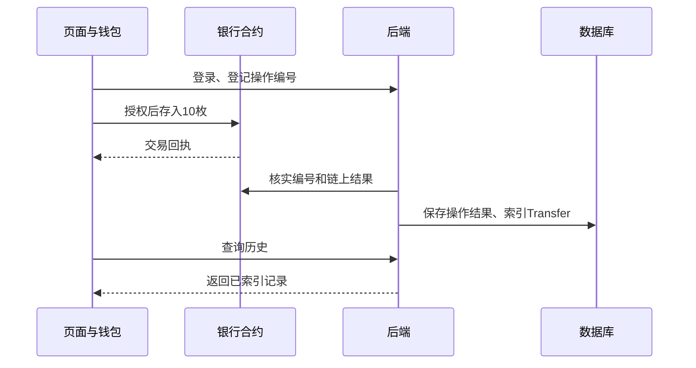

# 13 · 从网页存入一笔 Token：全栈如何合作

这个项目把 [07 的代币银行](../tokenbank-07/README.md) 与 [12 的历史索引](../erc20-event-indexer-12/README.md) 接成一个可操作的网页。完成后，你应能解释一笔存款经过哪些程序、资产在哪里、失败后从哪里继续。

## 用 100 枚代币走完一次闭环

假设 Alice 钱包有 100 BERC20，个人存款为 0。她在页面输入 10，先登录、授权，再存款。成功后钱包 90、个人存款 10、银行实际资产 10；取出 4 后分别是 94、6、6。

如果 Bob 也存入 20，Alice 可提仍是 6，银行总资产则是 26。页面连接谁，就查询谁的个人账本；切账户不会创建另一家银行。

三个数据不要混淆：

- 钱包余额：`Token.balanceOf(Alice)`，还在 Alice 地址上的代币。
- 个人银行存款：`Bank.balances(Alice)`，Alice 可取的金额。
- 银行总资产：`Token.balanceOf(Bank)`，所有人存入及直接转入的代币。

## 先理解谁负责什么


```mermaid
sequenceDiagram
  participant U as 页面与钱包
  participant B as 银行合约
  participant A as 后端
  participant D as 数据库
  U->>A: 登录、登记操作编号
  U->>B: 授权后存入10枚
  B-->>U: 交易回执
  A->>B: 核实编号和链上结果
  A->>D: 保存操作结果、索引Transfer
  U->>A: 查询历史
  A-->>U: 返回已索引记录
```

链上合约保管资产并决定谁能取款；后端保存会话、核实操作并索引历史；数据库不能通过改一行记录就改变真实余额。页面余额和历史列表也可能在不同时间更新。

## 第一次学习，先跑自动闭环

需要 Node.js 24+、npm、pnpm、Foundry 和 PostgreSQL。从仓库根目录执行：

```bash
cd tokenbank-fullstack-13
npm --prefix backend ci
pnpm --dir frontend install --frozen-lockfile
forge test --root contracts
pnpm --dir frontend test
```

准备好可连接的测试 PostgreSQL 后，再执行：

```bash
npm --prefix backend run test:integration
pnpm --dir frontend test:integration
```

后端集成测试会启动独立 Anvil、部署本项目合约、存入 `10.000000000000000001`、取出 4，并核对数据库/API/前端代理；用随机 schema 隔离，结束清理。精确的小数用于确认金额没有经过浮点数损失。

2026-10-09 已通过 4 项合约、11 项前端、4 项后端测试及 2 项本地集成测试，并通过前后端 lint 和类型检查。接口集成通过也不等于已经用浏览器钱包完成验收。

## 再打开页面亲手操作

按 [WALKTHROUGH](WALKTHROUGH.md) 执行。第一次创建隔离环境；如果已有学习记录，先走“继续使用上一轮数据”，保留链状态、配置和数据库。

网页本身不会给钱包发测试币。钱包需要同一条本地链上的 ETH 支付模拟 Gas，以及本项目 Token 的余额。MetaMask 添加代币只让它显示已有资产，不会产生新币。

两次“签名/确认”也可能不同：SIWE 是登录、证明你控制账户；ERC20 approve 是允许银行扣指定代币；deposit 才是实际存款。授权成功不能显示成存款成功。

## 刷新或超时后为什么不能重新点一笔

新银行 `IdempotentTokenBank` 要求每笔业务带 `operationId`（操作编号）。同账户、同编号、同参数重复执行只产生一次资金效果；同编号改金额会被拒绝，这叫**幂等**。

例如存 10 时页面断线，链上可能已经成功。恢复后要用原编号核实，不能因为没看到结果就生成新编号再存 10。取消只停止等待和后续步骤，不能撤销已广播交易。详细例子见 [REQUESTS](REQUESTS.md)。

旧 `TokenBank` 仍保留源码与部署；新页面只对幂等版写入，旧余额没有自动迁移。直接向银行转 Token 也不会增加个人存款。

## 按一次操作读源码

1. [前端说明](frontend/README.md)：从金额输入和钱包确认开始。
2. [银行合约](contracts/src/IdempotentTokenBank.sol)：看操作去重、收币和扣账。
3. [后端说明](backend/README.md)：看身份验证、链上核实和历史查询。
4. [数据库说明](database/README.md)：理解事件、操作、会话各存什么。
5. [请求与恢复](REQUESTS.md)：最后读取消、冲突、重组这些失败分支。

实现各自位于本项目 `contracts / frontend / backend / database`，运行时不导入兄弟项目业务代码；普通授权练习在这里，签名存款继续学 [16](../eip712-permit-16/README.md)。

## 排错先核对一组身份

RPC、chain ID、Token、银行、钱包账户、索引数据库必须指向同一轮环境。两条 Anvil 都可能叫 31337，仅 chain ID 相同不足以证明连的是同一条链。

若登录被拒，核对 `PUBLIC_ORIGIN` 与浏览器地址是否完全相同；`localhost` 和 `127.0.0.1` 不是同一来源。若交易成功但列表为空，先查索引进度，不要重复存款。
