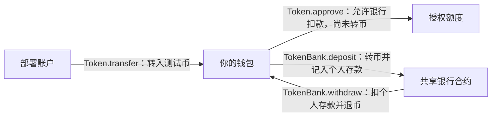
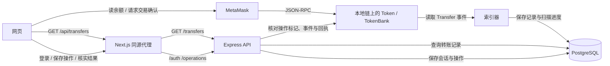

# Token Bank 前端

新增请求与幂等闭环请先读 [REQUESTS.md](../REQUESTS.md)，其中说明新版银行、SIWE 会话、操作表、取消和恢复边界。

参考 [Uniswap](https://app.uniswap.org/) 的浅色导航、居中交易卡片及粉色主操作，保留本仓库的 TokenBank 存取款与转账记录业务。钱包余额、个人银行存款、银行总资产、代币精度及记录均来自实际合约和索引服务。

技术栈与 `multi-chat-py-01/web` 对齐：Next.js 16 App Router、React 19、TypeScript、Tailwind CSS 4、TanStack Query、pnpm、Biome、Husky 和 lint-staged。钱包连接使用 Wagmi，合约调用使用 Viem。

样式统一使用 Tailwind CSS：布局、间距、字体、颜色及响应式状态写在组件的工具类中；`app/globals.css` 只保留 `@theme` 主题、基础样式和通过 `@apply` 复用的按钮、弹窗、提示。`mobile:` 与 `compact:` 分别对应原页面的 `640px`、`374px` 最大宽度断点，包含边界值。

建议先读下面的账户与资金流程，再按 [从启动到验收的实操指南](../WALKTHROUGH.md) 操作：

- 继续使用之前 `3180` 页面的测试数据：从[复用上一轮环境](../WALKTHROUGH.md#0-继续使用上一轮数据)开始。
- 第一次部署，或旧的本地链已经丢失：从[新建本地环境](../WALKTHROUGH.md#1-先确认环境与端口)开始。
- 服务都已启动，只想通过页面存取款：看[连接钱包](../WALKTHROUGH.md#6-终端-d启动页面并连接钱包)和[页面操作](../WALKTHROUGH.md#7-页面操作存款取款与余额验收)。

## 先理解账户、代币和银行

### 四个容易混淆的对象

| 对象 | 用途 | 在哪里使用 |
| --- | --- | --- |
| 钱包账户地址 | 标识谁持有代币、谁拥有存款；通过对应账户签名操作 | 页面右上角、MetaMask 收款地址 |
| Token 合约地址 | 记录各地址的 BERC20 余额和授权额度 | MetaMask 添加代币；银行的 `token()` |
| TokenBank 合约地址 | 保管代币，并按钱包地址记录每人的存款 | 页面齿轮里的银行设置 |
| RPC URL | 访问某个区块链节点的入口 | 钱包网络、前端和索引器配置 |

同一条链上，钱包地址和合约地址都以 `0x` 开头，但用途不同。连接钱包选择的是自己能签名的账户，不能通过填写银行地址来“登录银行账户”。本轮具体地址见[旧环境配置](../WALKTHROUGH.md#0-继续使用上一轮数据)。

ETH 用来支付交易手续费；BERC20 是本页面存取的代币。有 10 ETH 不等于有 10 BERC20。MetaMask 添加 BERC20 只是让它显示已有余额，不会创建或转入代币。本地测试资产在本地链有效。

### Anvil、MetaMask 和 Foundry 账户有什么区别

- **Anvil 默认账户**：本地节点启动时提供的测试账户。默认配置下，账户 0 是 `0xf39Fd6e51aad88F6F4ce6aB8827279cffFb92266`，预置本地 ETH；本轮由它部署 Token，因此也由它持有初始发行的 BERC20。
- **MetaMask 账户**：钱包管理的签名账户。现有账户连接本地 RPC 后就能使用本地链；收到测试 ETH 和 BERC20 即可操作，不必改成 Anvil 账户。
- **`cast wallet list` 的账户**：本机 Foundry 加密密钥库中的别名，例如 `blocklight-buyer`、`blocklight-deployer`、`sepolia-deployer`。`(Local)` 指密钥保存在本机，不表示它属于 Anvil；别名也不会限制该账户只能用于某条链。

同一私钥导入不同钱包工具得到同一地址；同一地址在不同链上的余额独立。Anvil 账户不会自动出现在 MetaMask 或 Foundry 密钥库中。下面只查看已有密钥库对应的公开地址，密码在自己的终端输入：

```bash
cast wallet list
cast wallet address --account blocklight-deployer
```

若要在网页使用 `0xf39F…2266`，先在自己的 Anvil 启动终端确认账户 0 及对应测试私钥，再通过 MetaMask 的账户菜单导入该账户，最后授权网站连接它。`--silent` 启动不会打印账户清单；不必为查看私钥重启已有链，直接使用已充值的 MetaMask 账户也能完成全部存取款。不要把私钥或助记词放进文档、聊天、网页配置或 Git；Anvil 默认测试密钥是公开的，只用于本地测试。

### 为什么切换账户，银行余额会不同

只要连接**同一个本地链实例、同一个银行合约地址**，所有账户使用的就是同一家银行。页面现在同时显示三项：

| 页面字段 | 链上读取 | 含义 |
| --- | --- | --- |
| 我的钱包余额 | `Token.balanceOf(当前账户)` | 还在自己钱包里的 BERC20，可存入或转给别人 |
| 我的银行存款 | `TokenBank.balances(当前账户)` | 银行记在自己名下的 BERC20，也是取款上限 |
| 银行总资产 | `Token.balanceOf(银行地址)` | 银行合约实际持有的全部 BERC20 |

例如 A 没存款、B 存了 100，且银行没有其他资产：

```text
连接 A：我的银行存款 = 0，   银行总资产 = 100
连接 B：我的银行存款 = 100， 银行总资产 = 100
```

A 不能取走 B 的 100。`withdraw` 在合约中检查交易发送者自己的存款，并将代币退给这个发送者；前端显示的总资产不会改变这一限制。页面默认只展示当前账户的存款，但链上账目是公开可查询的，不是只有本人能读取。

直接把 Token 转到银行地址，也会增加银行总资产，却不会增加任何人的存款账目。因此总资产不一定等于个人存款之和，不能拿它当自己的可提余额。本合约没有认领这类直接转入资金的接口，存款请使用页面“存入”。

### 从转入钱包到存款，再到取款



1. **转入钱包**：部署账户向你的钱包发送 BERC20。钱包余额增加，个人银行存款不变。
2. **授权**：允许银行从钱包扣除指定数量的 Token。授权本身不转币，不增加存款；授权不足时页面会先请求确认授权。
3. **存入**：银行执行 `transferFrom` 将 Token 从钱包转进银行，同时增加这个钱包名下的存款。首次通常要确认“授权”和“存款”两笔交易。
4. **取出**：银行扣减当前账户的存款，将 Token 转回当前钱包。无需再次授权，也不是退给 Token 合约或部署账户。

本页面没有指定收款人的输入框。要给另一个钱包转币，可在完成本指南验收后，通过 MetaMask 选择 BERC20 → 发送 → 填入对方钱包地址和金额 → 确认。双方使用同一个本地链实例和 Token；发送方需要 Token 和支付手续费的本地 ETH。这个操作不改变双方的银行存款。当前 TokenBank 也没有银行账户之间的内部转账功能。

页面金额框里的大号 `0` 是待输入金额；余额看输入框下方和卡片下方三项。存入模式的“全部”选择钱包余额，取出模式的“全部”选择自己的银行存款。取款后 MetaMask 的 BERC20 余额增加，本地 ETH 会因手续费略微减少。

## 页面、钱包与 REST API 如何配合



前端通过钱包提供的 RPC 读取余额、请求签名和发送交易；Express 负责登录验证、操作登记、链上结果核实和历史查询。数据库不决定谁可以取款，也不会通过修改数据库改变链上余额。钱包连接只建立网站与账户的连接；首次操作还需 SIWE 登录签名，由服务端验证身份并建立会话。

浏览器可以发起 REST 请求，本项目使用同源 `/api/transfers`，再由 Next.js 请求 Express。`address` 选择查询账户，`limit` 是条数，`offset` 是跳过条数；API 返回链、Token、精度、扫描进度和转账数组。实际请求示例见[前端代理核对](../WALKTHROUGH.md#6-终端-d启动页面并连接钱包)。

记录里的“转入 / 转出”是相对当前钱包而言：存款显示转出到银行，取款显示从银行转入。授权产生 `Approval`，不会出现在只索引 `Transfer` 的列表中。该页面与索引器各自围绕配置的一个 Token 工作，不是本地所有代币的目录；查找其他 Token 应使用对应部署回执或项目部署记录，再分别添加到 MetaMask。

## 目录与请求流程

```text
features/bank-dashboard.tsx         页面布局、导航与账户工作区切换
features/bank-workspace.tsx         余额查询、交易提交、终止与恢复状态
domains/bank/amount-fields.tsx      金额输入、全部金额与到账预览
domains/bank/bank-balances.tsx      三种余额与合约链接
domains/bank/bank-settings-dialog.tsx  银行设置弹窗、草稿与地址校验
domains/operations/operation-notice.tsx  未完成操作的核实与继续入口
domains/operations/client.ts          保存业务意图、登录、登记与核实结果
domains/wallet/wallet-button.tsx       钱包选择、连接与断开
domains/transfers/transfer-history.tsx    转账记录、分页与定时刷新
app/providers.tsx          Wagmi 与 React Query
app/api/transfers/route.ts  开发 / 生产通用的同源 API 代理
app/api/backend/[...path]/route.ts  登录与操作接口的同源入口
shared/request.ts          HTTP 并发队列、响应校验与终止
shared/query-client.ts      查询重试与统一错误入口
shared/error-queue.ts       最多三条提示的合并、排序与故障抑制
shared/error-toaster.tsx    展示队首提示并处理关闭
app/globals.css             页面样式与移动端布局
domains/bank/client.ts                 金额校验、合约读写
domains/transfers/client.ts   索引结果校验
domains/transfers/queries.ts  查询键、取消信号与刷新配置
domains/wallet/config.ts                钱包网络与区块浏览器配置
tests/                     Node 原生测试及本地链集成检查
```

阅读页面时先看 [bank-dashboard.tsx](features/bank-dashboard.tsx) 的组合，再看 [bank-workspace.tsx](features/bank-workspace.tsx) 的请求与交易流程，最后按需进入领域组件。金额和交易状态由工作区统一管理，展示组件通过明确的属性和回调交互；设置弹窗只管理自己的草稿。账户、网络、钱包连接或银行地址变化时，工作区的 `key` 重建界面状态，并按新作用域查找已保存的操作。

```text
页面 → Wagmi 连接浏览器钱包 → Viem 读取 Token / TokenBank
首次提交 → 校验金额 → 保存 operationId 与参数 → SIWE 登录（已有有效会话则复用）
  → 后端创建/复用操作 → 查询是否已完成
  → 未完成：检查链上状态 → 存款按需授权 → 模拟并发送带原编号的存款/取款交易
  → 保存哈希 → 等待回执 → 后端按确认深度核实操作与事件
  → 已确认：显示成功提示 → 清除本笔恢复记录与输入金额 → 解锁表单 → 刷新余额与转账记录

刷新页面 → 恢复已保存操作 → 等待用户选择“核实结果”或“使用原操作继续”
终止请求 → 停止后续步骤与自动查询 → 保留操作编号和已知/晚返回的哈希

浏览器 GET /api/transfers?address=…&limit=10&offset=0
  → Next.js 同源代理
  → Express GET /transfers（参数校验、查询 PostgreSQL）
  → 前端核对网络、Token、账户、精度后显示记录
```

页面每 15 秒刷新余额和记录。交易中的余额轮询暂停；操作核实成功后立即重新读取余额。索引器有独立的确认区块等待，刚成功的交易可能稍后才出现在记录中。链上余额查询不依赖 Express，但新版提交与恢复需要后端登录、操作和核实接口；单独的历史查询失败不会改变链上余额。

成功后可直接输入下一笔金额或切换存取款，无需手动重置；再次提交才会创建新的操作编号。核实/继续按钮只出现在需要恢复的操作下，授权成功、失败或结果待核实不会清空这笔操作。旧版本已保存的成功记录仍先核实，成功后自动收起。

对照源码串接后端与合约，见 [REQUESTS：阅读与调用顺序](../REQUESTS.md#1-阅读与调用顺序)。不要把 SIWE 登录、Token 授权、银行交易回执和历史索引完成当成同一个阶段。

## 1. 确认合约

新版存取款使用本项目的 [IdempotentTokenBank.sol](../contracts/src/IdempotentTokenBank.sol)，要求 `token()`、`balances(address)`、`operationHash(address,bytes32)`、`deposit(uint256,bytes32)`、`withdraw(uint256,bytes32)` 接口。旧 [TokenBank.sol](../contracts/src/TokenBank.sol) 保留供学习与历史环境使用，在当前页面仅可读取，不能提交存取款。

- 银行地址必须是 TokenBank，不能填写 Token 或 NFTMarket 地址。
- Sepolia 的现有 Token 为 `0xaa0ce32d799459b6a617a0c07cfc79b4048e4dbc`。
- Base 的现有 ERC20WithCallback 为 `0xaddf9b7e606ad7ad04d474b2e6c3af47696b662c`。
- Base 上的 `0x069b4ec66e0603b8ab012a5a2ec8a26cba4d3f16` 是 NFTMarket，不能用于本页面。
- 新建本地环境按 [WALKTHROUGH](../WALKTHROUGH.md) 部署幂等版银行，构造参数填本轮 BaseERC20 地址。上述公共链地址只是历史记录，不代表已部署兼容的新版银行。

前端按标准“授权 + 存款”执行，不调用 `transferWithCallback`。直接把 Token 转到银行地址不会增加个人存款。

## 2. 启动 Express 索引器

以下是已有合约时的只读索引配置参考，以 Sepolia 为例；本地完整存取款环境请使用实操指南，避免把这组配置混入本地环境。

需要 Node.js 24+、本机 PostgreSQL，以及目标网络 RPC。以下从本项目根目录执行；数据库不存在时先执行 `createdb erc20_indexer`。

```bash
cd backend
npm ci
test -f .env || cp .env.example .env
```

先按目标网络填写索引器 `.env`，详细参数见 [索引器说明](../backend/README.md)：

```dotenv
RPC_URL=https://你的目标网络RPC
CHAIN_ID=11155111
TOKEN_ADDRESS=0xaa0ce32d799459b6a617a0c07cfc79b4048e4dbc
START_BLOCK=11702875
PGDATABASE=erc20_indexer
HOST=127.0.0.1
PORT=3001
```

`START_BLOCK` 是 Token 部署区块。前端钱包网络、银行的 `token()`、后端 `CHAIN_ID` / `TOKEN_ADDRESS` 必须一致。更换链或 Token 时使用独立的索引数据库。

要启用新版写接口，还须配置 `BANK_ADDRESS` 为本轮幂等银行、`PUBLIC_ORIGIN` 为实际页面来源，且前后端银行地址一致；具体示例见 [REQUESTS：配置与运行](../REQUESTS.md#6-配置与运行)。只读索引配置本身不能完成新版存取款闭环。

配置完成后，在 `backend` 目录启动并保持运行：

```bash
npm start
```

## 3. 启动 Next.js 前端

另开一个终端，从本项目根目录执行：

```bash
cd frontend
pnpm install --frozen-lockfile
test -f .env.local || cp .env.example .env.local
```

先填写 `.env.local`：

```dotenv
NEXT_PUBLIC_BANK_ADDRESS=0x填写已部署TokenBank地址
NEXT_PUBLIC_CHAIN_ID=11155111
NEXT_PUBLIC_EXPLORER_URL=https://sepolia.etherscan.io
INDEXER_URL=http://127.0.0.1:3001
```

配置完成后，在 `frontend` 目录启动；之后修改环境变量需重启开发服务：

```bash
pnpm dev
```

打开 `http://127.0.0.1:3000`。银行地址也可留空，在页面右上角的设置按钮中填写；页面输入只在本次页面会话有效，长期配置写入环境变量。

支持网络：Sepolia `11155111`、Base `8453`、Anvil `31337`。配置其他链会明确报错。Base 使用 `https://basescan.org`；本地链可将区块浏览器设为空，并通过 `NEXT_PUBLIC_LOCAL_RPC_URL` 配置 RPC，默认 `http://127.0.0.1:8545`。

未设置 `NEXT_PUBLIC_CHAIN_ID` 时默认使用本地 Foundry（`31337`）；Sepolia 和 Base 需要显式配置。复习时将网络、RPC、银行地址与 `INDEXER_URL` 保存到本目录 `.env.local`（已被 Git 忽略），Next.js 会在启动时自动读取，避免只在某次终端中 `export`、重启后丢失配置。`3180` 旧环境使用 `18545 / 13001`，`3181` 独立环境使用 `18546 / 13002`，按实际环境整组配置。

`NEXT_PUBLIC_` 变量会进入浏览器，不能填写私钥、助记词或私有 RPC 密钥。`INDEXER_URL` 仅由 Next.js 服务端读取。旧的 `VITE_` 环境变量和 Vite 启动方式已移除。

## 4. 使用与异常处理

1. 点击“连接钱包”，选择具体钱包名称，批准账户连接和目标网络切换。页头显示实际连接网络；点击地址可查看钱包名称、完整地址、链 ID 和本地目标 RPC。地址不对时点“断开并重新选择”。
2. 输入存款金额，或点“全部”。授权不足时先确认本次金额的授权，再确认存款。
3. 切换“取出”，输入不超过“我的银行存款”的金额，确认取款。
4. 交易状态会显示签名等待、链上确认、成功或失败。查看下方余额与记录，也可手动刷新或翻页。

金额使用 bigint 和 Token 的 decimals，拒绝零、负数、科学计数法、超精度及超余额。交易提交前先模拟，每次签名前复核账户和网络。账户、网络或合约切换时清空原输入及记录，旧流程不会继续请求签名。

拒签不会当成交易成功。授权成功后拒绝存款，已经确认的授权仍会保留。确认超时或交易被替换时，请先在钱包中核对结果再重试。未连接及接口错误时不显示伪造的零余额或转账记录。

## 5. 生产运行

```bash
pnpm build
pnpm start
```

这是需要 Node.js 服务的 Next.js 应用；`/api/transfers` 在生产也代理到 Express，无需额外设置浏览器 CORS。生产启动时必须配置正确的 `INDEXER_URL`。`NEXT_PUBLIC_` 配置在构建时写入，修改后需要重新构建。

## 6. 验证

```bash
pnpm lint
pnpm format:check
pnpm typecheck
pnpm test
pnpm test:integration
pnpm build
```

普通测试覆盖精确金额、非法输入、记录身份校验及同源代理的查询 / 错误透传。集成检查需安装 Foundry，自动启动独立 Anvil 并部署已有合约，验证实际授权、存取款、拒签、超余额和账户 / 网络变化；不使用公共网络资金。编译产物只写到仓库 `output-tdd/tokenbank-fullstack-13/contracts/`。

Husky 复用仓库 `multi-chat-py-01/web/.husky/pre-commit`。提交本目录文件时执行 Biome 暂存文件检查和格式化，再运行类型检查、普通测试，保留原有项目的检查流程。`pnpm-lock.yaml` 是前端唯一锁文件。
