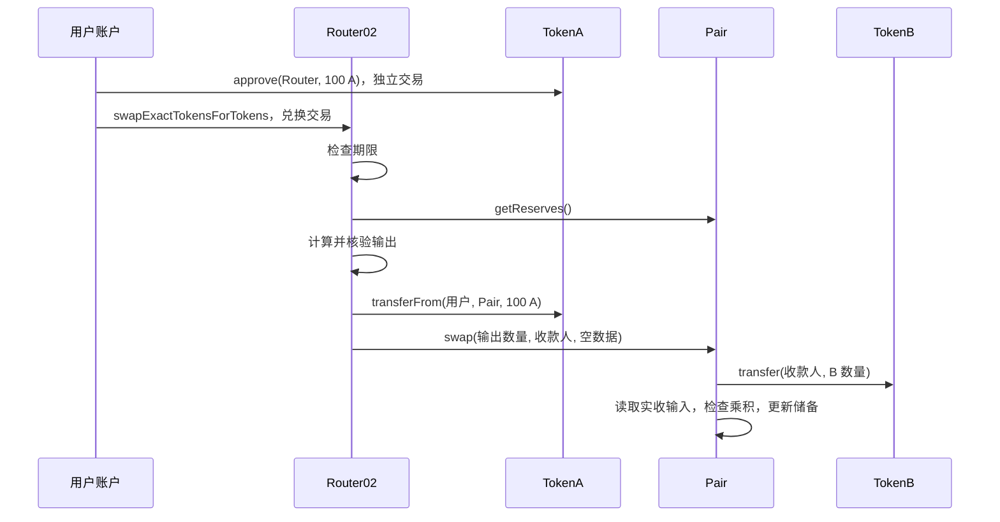

# 跟着三笔操作读懂 Uniswap V2：加池、兑换、退出

本文面向会基础 Solidity、第一次阅读 Uniswap V2 的读者。先看谁调用谁、钱在哪里、状态何时更新，再看公式。可照着 [操作指南](README.md) 在本地验证；源码版本与差异见 [UPSTREAM.md](UPSTREAM.md)。本文随代码保存在仓库中，没有另行发布到博客或社区。

## 1. 先认清四个角色

把一个交易池想成自动兑换摊位：有人先放入 A、B 两种币，其他人才能拿 A 换 B。真正执行规则的是合约；这个类比只帮助理解分工。

- **Factory：创建池子的工厂。** 同一对代币只创建一个 Pair，并记录地址。A/B 和 B/A 是同一个池。
- **Pair：存钱并执行兑换的池子。** 持有 A、B 两种 ERC20，同时发行自己的 LP 代币。
- **Router02：帮用户组合操作的入口。** 负责配比、转币、滑点和期限检查；资金主要在用户与 Pair 之间移动。
- **Library：Router 使用的计算代码。** 计算池地址和兑换数量。本工程这些函数是 `internal`，会进入调用者字节码，不是另外部署的服务。

这里 LP 有两个常见含义：流动性提供者，以及代表池子份额的 LP 代币。下文说“收到 LP”“授权 LP”时，指的是代币。

先记住地址关系：

```text
TokenA 地址：A 的 ERC20 合约
TokenB 地址：B 的 ERC20 合约
Pair 地址：A/B 池子，同时也是 LP 的 ERC20 合约
Router 地址：用户调用和授权的操作入口
Factory 地址：记录 TokenA + TokenB 对应哪个 Pair
```

“币在 Pair 里”是指 `TokenA.balanceOf(pair)` / `TokenB.balanceOf(pair)` 有余额。ERC20 的余额账本仍存放在各自的代币合约中。

## 2. 部署脚本已经替你完成了哪些操作

打开 [DeployUniswapV2.s.sol](script/DeployUniswapV2.s.sol)，从 `run()` 往下看。本地广播一共发出 8 笔交易：

```text
第 1～5 笔：部署 Factory、WETH9、Router02、TokenA、TokenB
第 6 笔：TokenA.approve(router, 10000 A)
第 7 笔：TokenB.approve(router, 20000 B)
第 8 笔：Router.addLiquidity(...)，内部建池、转币、铸造 LP
```

WETH 用于 Router 的 ETH 兑换入口；本教程主流程只换 A/B，先不需要操作它。两个示例 ERC20 的符号都是 `UNI-V2`，LP 也沿用这个符号，因此练习时按地址识别，不能按名称判断。

脚本完成后，账户各有 `990000 A`、`980000 B`，池里有 `10000 A`、`20000 B`，账户还持有 LP。示例币最初各发行 `1000000` 枚。

为了简化操作，同一个本地账户既提供流动性，又执行后续兑换。真实使用中这通常是不同的人；不要把这个例子理解成收益演示。

### 为什么脚本没有直接 `new UniswapV2Factory(...)`

Core 固定使用 Solidity `0.5.16`，Router 固定使用 `0.6.6`，脚本和测试使用 `0.8.24`。这些实现不能放进同一个不兼容的编译单元。

所以 Foundry 分别编译，再由 `deployCode` 读取对应产物并执行部署。脚本只导入兼容的接口来调用它们。链上运行的是各自编译器生成的字节码，不是把旧版源码改成了 0.8。

还要区分事务边界：8 笔部署交易不组成一个原子事务。如果最后一笔失败，前面成功部署的合约和授权不会自动撤销；应先查回执，不要直接再部署一整套。

## 3. 第一条调用链：添加流动性

先看 [Router02.addLiquidity](src/periphery/UniswapV2Router02.sol)，再看 [Factory.createPair](src/core/UniswapV2Factory.sol) 和 [Pair.mint](src/core/UniswapV2Pair.sol)。

### 第一步：用户授权 Router

```solidity
// 两次独立调用：设置可由 Router 代扣的上限，此时还没有把币转进池子。
tokenA.approve(address(router), amountA);
tokenB.approve(address(router), amountB);
```

执行 `approve` 时，代币合约里的 `msg.sender` 是用户，因此写入的是 `allowance[用户][Router]`。授权对象是 Router，因为稍后调用 `transferFrom` 的是 Router。

### 第二步：Router 确认池子存在，并选择投入数量

用户调用 `addLiquidity` 后，Router 的 `_addLiquidity` 先查 Factory。不存在就 `createPair`：排序代币地址，使用 CREATE2 部署，再调用 Pair 的 `initialize`。

此时 `createPair` 中的 `msg.sender` 是 Router；Pair 构造函数和 `initialize` 中的 `msg.sender` 是 Factory。因此 Pair 记录的 `factory` 是 Factory，而不是用户或 Router。

首个提供者决定初始双币比例。本例是 `10000:20000`。池子已有储备时，Router 会按现有比例选择实际投入，避免直接把多余的一边送进去；期限和对应最小数量检查也在 Router 层。

### 第三步：币直接从用户进入 Pair，再领取 LP

```text
用户 → Router.addLiquidity
         ├─ TokenA.transferFrom(用户, Pair, 实际 A 数量)
         ├─ TokenB.transferFrom(用户, Pair, 实际 B 数量)
         └─ Pair.mint(LP 接收者)
```

`transferFrom` 在 ERC20 合约中看到的 `msg.sender` 是 Router，所以消耗刚才的授权。两种币直接进入 Pair，不需要先存到 Router。

`mint` 根据“实际余额减去旧储备”计算本次到账，再铸造 LP，最后更新储备。首次总份额按 `sqrt(amountA * amountB)` 计算；后续按投入占原储备的较小比例计算。

首次会永久锁定 `1000` 个 LP **最小单位**到零地址，其余给用户。LP 是 18 位精度，所以锁定量不是 1000 枚完整 LP。本例用户得到约 `14142.1356` 枚 LP。

源码中的 `mint` 铸造的是 LP，没有凭空增加池内的 A 或 B。对应测试：`testMintAndBurnMinimumLiquidity`、`testAddLiquidityUsesOptimalRatio`。

## 4. 第二条调用链：用 100 A 换 B

重点读 [Router02.swapExactTokensForTokens](src/periphery/UniswapV2Router02.sol)、同文件的 `_swap`，以及 [Pair.swap](src/core/UniswapV2Pair.sol)。函数名里的 `ExactTokens` 表示输入数量固定。

### 先看这次操作应该改变什么

```text
开始：池中 10000 A、20000 B
输入：用户支付 100 A
输出：用户收到约 197.4316 B
结束：池中 10100 A、约 19802.5684 B
用户的 LP 数量：这次 Swap 不改变它
```

部署时授权的 `10000 A` 已在加池时用完，所以指南会先重新授权 `100 A`。新增授权依然不代表已经付款。

### Router 先检查条件，再发起转账

```solidity
// 示意调用；path = [TokenA 地址, TokenB 地址]。
router.swapExactTokensForTokens(
    amountIn,      // 固定支付多少 A
    amountOutMin,  // 至少要收到多少 B
    path,          // 按顺序经过哪些代币
    recipient,     // B 发给谁
    deadline       // 超过哪个区块时间就不再执行
);
```

进入 Router 后，`ensure` 检查期限；Library 读取池储备并计算输出；Router 检查输出不少于 `amountOutMin`。然后才由 Router 把 A 从用户转进 Pair，并调用 `_swap`。

`_swap` 根据代币地址排序决定输出放在 `amount0Out` 还是 `amount1Out`。`token0` 不一定是教程里的 A；这是看懂储备和交换参数的关键。



这里的箭头是调用关系。例如 Pair 调用 `TokenB.transfer` 时，B 合约里的 `msg.sender` 是 Pair，因此扣的是 Pair 的 B 余额。A、B 都不会先在 Router 中中转。

### Pair 为什么还要重新检查

Pair 不相信调用者报出的输入。它先给出指定输出，再读取最终余额，推导真正收到了多少输入，检查扣除手续费后的乘积。如果不满足条件，整笔兑换交易回滚。

Router 为用户检查期限和最低输出；Pair 为池子检查资产约束。直接调用 Pair 也不能绕过后者，但调用者需要自行负责前者。

注意“整笔”指当前兑换交易：这笔交易中的 A/B 转账、授权额度扣减和储备变化会回滚；**上一笔成功的 `approve` 仍然存在**。

### `balance` 和 `reserve` 为什么不是一回事

`balanceOf(pair)` 是此刻实际余额，`reserve` 是 Pair 上次更新时保存的快照。Router 把 `100 A` 转入后、Pair 更新前，A 的余额是 `10100`，对应储备仍是 `10000`。

因此，对于只输入 A、只输出 B 的本次交换：

```text
实际输入 A = A 当前余额 - A 旧储备 = 10100 - 10000 = 100
```

通用代码还要考虑同一侧有输出，所以写成 `max(balanceAfter - (reserveBefore - amountOut), 0)`。检查通过后，`_update` 才把当前余额保存为新储备。

对应测试：`testExactInputSwap`、`testSlippageAndDeadlineRollback`、`testSwapWithoutRepaymentRollsBack`。

## 5. 为什么拿不到按 1:2 比例计算的 200 B

先用小数字忽略手续费：池中 `100 A、200 B`，乘积为 `20000`。投入 `1 A` 后，若要保持乘积，B 只能剩下 `20000 / 101 ≈ 198.0198`，所以能取出约 `1.9802 B`。

随着输入 A、取出 B，池内比例也在改变，不能让有限数量的整笔交易都按起点的 `1:2` 成交。这叫价格冲击。

V2 还收取输入数量的 `0.3%` 交易费，报价公式中的 `997/1000` 就来自这里：

```text
输出 = 向下取整(
    输入 × 997 × 输出币储备
    ÷ (输入币储备 × 1000 + 输入 × 997)
)
```

把 `10000 A / 20000 B` 和输入 `100 A` 代入，就得到 `197.431606879412259770 B`。这些费用留在池中；实际储备乘积通常会增加，而不是永远严格不变。

手续费、价格冲击、滑点容忍度、Gas 是不同的事：

- 手续费：协议固定的兑换费用，这里是输入的 `0.3%`。
- 价格冲击：本次交易推动池比例变化而产生的报价影响。
- 滑点容忍度：用户允许最终输出比查询报价低多少。指南中的 `0.5%` 是输出限制，不是额外收费。
- Gas：执行交易支付的链上计算费用，用链的原生币支付；本例只消耗 Anvil 测试 ETH。

金额在合约里用整数表示。本例三个 ERC20 都是 18 位精度，`100000000000000000000` 才表示 100 枚。指南用 `cast to-wei` / `cast from-wei` 换算这一精度，不代表 A、B 变成了 ETH；其他精度的代币不能直接套用。

## 6. 第三条调用链：撤出流动性

读 [Router02.removeLiquidity](src/periphery/UniswapV2Router02.sol) 和 [Pair.burn](src/core/UniswapV2Pair.sol)。退出需要交还 LP，因为 LP 代表份额。

```text
用户 → Pair.approve(Router, 用户 LP 数量)，独立授权交易
用户 → Router.removeLiquidity(...)
         ├─ Pair.transferFrom(用户, Pair, LP 数量)
         └─ Pair.burn(收款人)
              ├─ 销毁 Pair 已收到的 LP
              ├─ 按份额把 A、B 转给收款人
              └─ 更新储备
         Router 最后检查 A/B 都不少于用户设定的下限
```

这里看似连续调用了两次 Pair，其实是在使用它的两个身份：`transferFrom` 操作 LP 代币账本；`burn` 操作池的流动性。需要授权的是 **LP**，不是再次授权 A/B。

赎回量约等于 `池中当前余额 × 交还 LP / 总 LP`。它取决于退出时的双币余额；通常不等于当初投入的两种数量。

即便最后的最低数量检查发生在 `burn` 之后，只要还在同一笔交易里，检查失败也会撤销本次销毁和转账。之前单独成功的 LP 授权仍然保留。

本例撤出全部用户 LP 后，用户 LP 为 0，总 LP 仍有锁定的 1000 最小单位，池内还留下极少量 A/B。对应测试：`testMintAndBurnMinimumLiquidity`、`testRemoveLiquiditySlippageRollsBackBurn`。

## 7. `init_code_hash`：为什么部署成功了，Router 却找错池子

Factory 和 Router 要对同一个 Pair 地址达成一致。Factory 用 CREATE2 创建；Router 的 `pairFor` 根据相同输入提前算出地址，不通过 `getPair` 查询它。

可以把 `init_code_hash` 理解为“创建 Pair 的那段机器码的指纹”。这只是哈希身份标识，不是安全审计或版本保证。

```text
Pair 地址由三项确定：
1. Factory 地址
2. salt：将代币地址排序后一起哈希
3. init_code_hash：Pair 创建字节码的哈希
```

如果 Factory 用本地机器码创建，而 Library 还写着另一份机器码的指纹，两边算出的地址就不同。Factory 能成功建池，Router 却可能在错误地址读储备或调用。

注释、依赖路径和编译设置可能改变 Solidity 的元数据，进而改变创建字节码。所以“只是加了注释”“版本没变”都不能保证哈希还相同。

本工程的修正过程是：先编译 Pair → 对创建字节码算 Keccak-256 → 更新 Library 的字面量 → 重新编译周边 → 比较预测与实际地址。操作命令在 [指南的哈希维护部分](README.md#修改源码后再看哈希维护)。

`testPairForMatchesActualCreationCode` 同时检查真实 Library、Factory 实际部署地址和创建字节码公式。上轮先保留原哈希，确实观察到失败，换成本地哈希后才通过。

<details>
<summary>展开看精确 CREATE2 公式</summary>

```text
(token0, token1) = sort(tokenA, tokenB)
salt = keccak256(abi.encodePacked(token0, token1))
initCodeHash = keccak256(UniswapV2Pair.creationCode)
pair = last20bytes(keccak256(0xff ++ factory ++ salt ++ initCodeHash))
```

哈希对象是 **creation bytecode**，不是 `deployedBytecode`，也不是部署交易哈希。

</details>

## 8. 怎么用测试确认自己读懂了

在项目目录执行下面一条，查看一次兑换的完整调用轨迹：

```bash
forge test --match-test testExactInputSwap -vvvv
```

输出里先有测试准备和加池，再有兑换。重点找到 `swapExactTokensForTokens`，沿缩进看 `transferFrom → swap → transfer → _update/Sync`；内部函数未必单独显示，但外部调用、事件和数量可以对照上面的说明。

再从 [测试文件](test/UniswapV2.t.sol) 找到这些场景：

- `testPairForMatchesActualCreationCode`：地址是否与真正部署的一致。
- `testSlippageAndDeadlineRollback`：最低输出过高、期限已过时，资金是否保持原状。
- `testRemoveLiquiditySlippageRollsBackBurn`：先 burn 后检查，为什么仍能完整回滚。
- `testFlashSwapRepaymentAndLock`：先输出再偿还时，资产检查和重入锁如何配合。

读完主流程，可以试着回答三个问题：为什么授权 Router 而币进 Pair？为什么转进 A 后还要读旧储备？为什么撤出流动性时要授权 Pair 这个地址上的 LP？答案分别对应调用者、实收输入和份额凭证。

## 9. 读懂主线后，再看这些分支

<details>
<summary>精确输出、多跳与 WETH</summary>

`swapTokensForExactTokens` 固定想拿到的输出，反算输入并检查 `amountInMax`；整数除法后加一，避免输入不足。`quote()` 只是按储备比例配比，不能当成带费用的 Swap 报价。

多跳路径如 `A → B → WETH`，上一池把输出直接送到下一池，Router 负责组织，不需要中间代币绕回用户。对应 `testMultiHopSwap`。

WETH 是 ETH 的 ERC20 包装：`deposit` 存入 ETH 得到等量 WETH，`withdraw` 反向操作。Router 的 ETH 入口负责包装与解包，Pair 仍处理两种 ERC20。对应 `testEthLiquiditySwapAndRemoval`。

</details>

<details>
<summary>手续费开关、累计价格、闪电兑换和 Permit</summary>

`feeTo` 为零时，协议费关闭；非零时，下一次 `mint/burn` 比较 `sqrt(k)` 的增长并向它铸造 LP。协议分配的是费用增长中的一部分，通常描述为 0.3% 中的约 0.05%，不会每笔再额外向交易者收取 0.05%。

```text
protocolLP = floor(totalSupply × (sqrt(k) - sqrt(kLast))
                   ÷ (sqrt(k) × 5 + sqrt(kLast)))
```

`_update` 用旧储备价格乘时间差，累加价格。两个时点的累计差除以时间差才是这段时间的 TWAP；一次储备读取只是当前池状态。原版保留了时间与累计值的整数环绕行为，直接迁移到 0.8 会改变这些约束。

闪电兑换在 `swap` 输出后调用接收合约，接收者必须在同一事务内完成足额偿还。同币偿还至少是 `ceil(amountOut × 1000 / 997)`；不是免费借款，也不能跨交易欠款。Pair 的 `lock` 防止回调期间再次进入资产操作。

LP 的 `permit` 用签名设置授权，依靠 EIP-712 域、nonce 与 deadline 区分合约、抵御重放和限制有效期。本工程的签名测试使用本地合成账户。

</details>

<details>
<summary>直接转币、特殊代币与本地验证的边界</summary>

直接往 Pair 转币不会自动得到 LP；任何人都能 `skim` 取走余额超过储备的部分。`sync` 则把实际余额记成新储备。添加流动性应把转币和 mint 组合在同一交易中。

转账扣费币需要对应的 supporting 路径，按净到账计算，但不能因此推断所有重基准或恶意代币都兼容。本工程保留上游入口，未逐一验证所有特殊代币。

上轮 19 项测试和 Anvil 操作证明本地配置下流程一致，不能替代安全审计或公共链验证。需要对照上游时，查看：

- [官方 Core](https://github.com/Uniswap/v2-core/tree/d2bfbb3649b265559bec74a7dd878dc1cf01c63c/contracts)。
- [官方 Router02](https://github.com/Uniswap/v2-periphery/blob/ed24991304291297c3b4a52818d02f46a17aa9a2/contracts/UniswapV2Router02.sol)。

</details>
